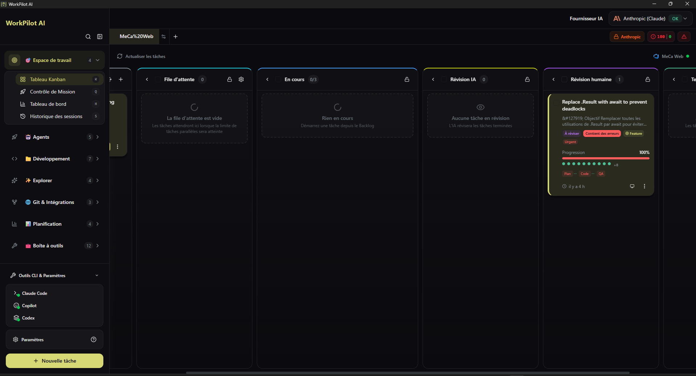
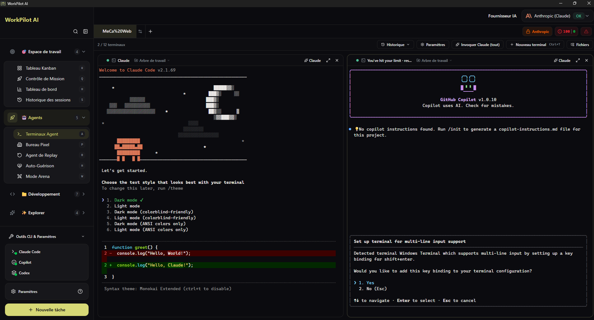
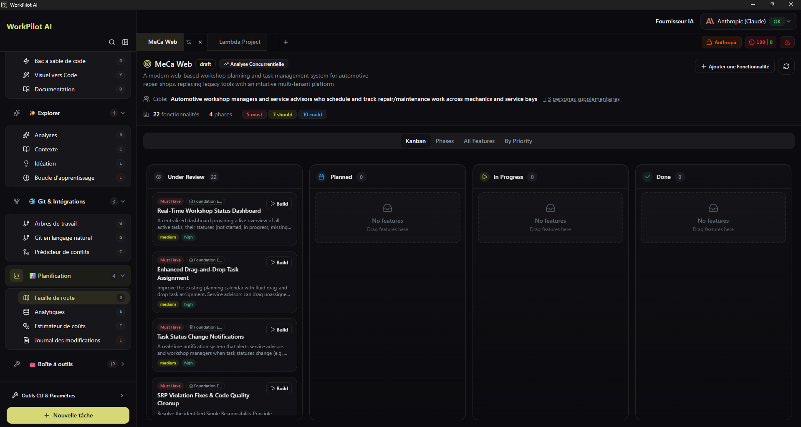

# WorkPilot AI

**Autonomous multi-agent coding framework that plans, builds, and validates software for you.**



[](./agpl-3.0.txt)
[](https://discord.gg/KCXaPBr4Dj)
[](https://www.youtube.com/@AndreMikalsen)
[](https://github.com/tleub-ebp/Auto-Claude_EBP/actions)

---

## Download

### Stable Release

<!-- STABLE_VERSION_BADGE -->
[](https://github.com/tleub-ebp/Auto-Claude_EBP/releases/tag/v1.0.0)
<!-- STABLE_VERSION_BADGE_END -->

<!-- STABLE_DOWNLOADS -->
| Platform | Download |
|----------|----------|
| **Windows** | [WorkPilot-AI-1.0.0-win32-x64.exe](https://github.com/tleub-ebp/Auto-Claude_EBP/releases/download/v1.0.0/WorkPilot-AI-1.0.0-win32-x64.exe) |
| **macOS (Apple Silicon)** | [WorkPilot-AI-1.0.0-darwin-arm64.dmg](https://github.com/tleub-ebp/Auto-Claude_EBP/releases/download/v1.0.0/WorkPilot-AI-1.0.0-darwin-arm64.dmg) |
| **macOS (Intel)** | [WorkPilot-AI-1.0.0-darwin-x64.dmg](https://github.com/tleub-ebp/Auto-Claude_EBP/releases/download/v1.0.0/WorkPilot-AI-1.0.0-darwin-x64.dmg) |
| **Linux** | [WorkPilot-AI-1.0.0-linux-x86_64.AppImage](https://github.com/tleub-ebp/Auto-Claude_EBP/releases/download/v1.0.0/WorkPilot-AI-1.0.0-linux-x86_64.AppImage) |
| **Linux (Debian)** | [WorkPilot-AI-1.0.0-linux-amd64.deb](https://github.com/tleub-ebp/Auto-Claude_EBP/releases/download/v1.0.0/WorkPilot-AI-1.0.0-linux-amd64.deb) |
| **Linux (Flatpak)** | [WorkPilot-AI-1.0.0-linux-x86_64.flatpak](https://github.com/tleub-ebp/Auto-Claude_EBP/releases/download/v1.0.0/WorkPilot-AI-1.0.0-linux-x86_64.flatpak) |
<!-- STABLE_DOWNLOADS_END -->

### Beta Release

> Beta releases may contain bugs and breaking changes. [View all releases](https://github.com/tleub-ebp/Auto-Claude_EBP/releases)

<!-- BETA_VERSION_BADGE -->
<!-- BETA_VERSION_BADGE_END -->

<!-- BETA_DOWNLOADS -->
<!-- BETA_DOWNLOADS_END -->

> All releases include SHA256 checksums and VirusTotal scan results for security verification.

---

## Quick Start

1. **Download and install** the app for your platform
2. **Open your project** — select a git repository folder
3. **Connect your AI provider** — Claude (OAuth), API key, or any OpenAI-compatible endpoint
4. **Create a task** — describe what you want to build
5. **Watch it work** — agents plan, code, and validate autonomously

Or from source:

```sh
pnpm install
pnpm run dev
```

See the [Setup Guide](docs/SETUP.md) for detailed instructions.

---

## Features

### Autonomous Development Pipeline

| Feature | Description |
|---------|-------------|
| **Kanban Board** | Visual task management from planning through completion with real-time agent progress |
| **Multi-Agent Pipeline** | Planner → Coder → QA Reviewer → QA Fixer pipeline runs autonomously end-to-end |
| **Parallel Execution** | Up to 12 simultaneous agent terminals for parallel builds |
| **Isolated Workspaces** | Every task runs in a dedicated git worktree — your main branch stays safe |
| **AI-Powered Merge** | Semantic conflict resolution when integrating worktrees back to main |
| **QA Auto-Fix Loop** | Agents automatically detect, fix, and revalidate failing acceptance criteria |
| **Spec Approval Workflow** | Review and approve AI-generated specifications before implementation begins |

### Multi-Agent Orchestration

| Feature | Description |
|---------|-------------|
| **Mission Control** | NASA-style dashboard for orchestrating multiple agents simultaneously — live status, token consumption, file changes, and per-agent reasoning |
| **Agent Replay & Debug** | Step-by-step replay of any agent session with timeline navigation, file diffs, breakpoints, and token heatmaps |
| **Decision Logger** | Real-time visualization of agent decision trees and trade-off rationale |
| **Pair Programming** | Interactive real-time AI coding partner with live suggestions and conversation-driven development |
| **Learning Mode** | Educational mode with step-by-step explanations of agent decisions |

### Specialized Agents

| Agent | Role |
|-------|------|
| **Planner** | Complexity assessment, phased subtask breakdown, dependency analysis |
| **Coder** | Context-aware implementation with parallel subagent spawning |
| **QA Reviewer / Fixer** | Acceptance criteria validation and automated issue resolution |
| **Test Generator** | Unit and integration test generation with coverage analysis |
| **Refactorer** | Safe code refactoring with pattern detection and API migration |
| **Documenter** | README, API docs, and architecture documentation generation |
| **Migration Agent** | Framework and library migration with breaking change detection |
| **Memory Manager** | Graphiti-based knowledge graph management across sessions |

### Integrations

| Platform | Capabilities |
|----------|-------------|
| **GitHub** | Import issues, AI investigation, PR review, batch review wizard, auto-PR creation |
| **GitLab** | Issues and merge request management with AI severity categorization |
| **Azure DevOps** | Work item import, PR review, batch operations |
| **Linear** | Bulk issue import with team/project filtering |
| **Jira** | Issue management integration |
| **MCP Marketplace** | Browse, install, and configure Model Context Protocol servers |
| **Custom MCPs** | Define and host custom MCP servers with local authentication |
| **Windsurf** | Windsurf IDE integration via Connect protocol |

### AI Providers & Authentication

| Provider | Auth Method |
|----------|-------------|
| **Anthropic Claude** | OAuth (subscription) or API key |
| **OpenAI** | API key |
| **Google Gemini** | API key |
| **Grok / xAI** | API key |
| **Ollama** | Local endpoint |
| **Azure OpenAI** | API key + endpoint |
| **GitHub Copilot** | OAuth |
| **Custom endpoints** | Any OpenAI-compatible API (e.g. z.ai for GLM models) |

**Multi-account switching** — Register multiple profiles per provider. WorkPilot AI automatically switches to an available account when one hits a rate limit.

### Code Intelligence

| Feature | Description |
|---------|-------------|
| **Insights** | AI chat interface for exploring and understanding your codebase with semantic search |
| **Ideation** | Discovers performance bottlenecks, security vulnerabilities, code quality issues, and UI/UX improvements |
| **Architecture Visualizer** | Dependency graphs, module hierarchy, and component relationship diagrams |
| **Performance Profiler** | AI-powered bottleneck identification with optimization suggestions |
| **Dependency Sentinel** | Monitors security vulnerabilities, version conflicts, and outdated dependencies |
| **Self-Healing Codebase** | Automatically generates fixes when CI tests fail; integrates with Sentry, Datadog, PagerDuty for production incidents |
| **Risk Classifier** | Scores code changes by risk level with impact assessment |

### Developer Productivity

| Feature | Description |
|---------|-------------|
| **Roadmap** | AI-assisted feature planning with prioritization and phased rollout |
| **Changelog** | Auto-generates release notes from completed tasks |
| **Natural Language Git** | AI-generated semantic commit messages from diffs |
| **Auto-Refactoring** | Pattern-based and architectural code transformations |
| **Code Migration** | Large-scale codebase migrations across frameworks and libraries |
| **Design to Code** | Converts UI mockups and screenshots to React/HTML |
| **Pipeline Generator** | Generates GitHub Actions, GitLab CI, and Azure Pipelines configurations |
| **Browser Agent** | Autonomous browser interaction for E2E test generation and visual regression |
| **Arena Mode** | Side-by-side comparison of different AI models on the same task |
| **Voice Control** | Hands-free task and terminal control via speech-to-text |
| **Multi-Repo Orchestration** | Coordinate changes across multiple repositories simultaneously |
| **Code Playground** | Sandbox environment for testing code snippets in isolation |
| **Prompt Optimizer** | Analyzes and rewrites prompts for better AI output |

### Memory & Context

| Feature | Description |
|---------|-------------|
| **Memory System (Graphiti)** | Graph-based semantic memory — agents retain insights across sessions |
| **Skills System** | Token-optimized dynamic skill execution with checkpoint-based context management |
| **Context Management** | Intelligent context building with file relevance ranking and dependency graph analysis |
| **Session History** | Browse and replay past agent sessions with full statistics |

### Analytics & Monitoring

| Feature | Description |
|---------|-------------|
| **Analytics Dashboard** | Token consumption, cost tracking, success rates, and execution time metrics |
| **Cost Estimator** | Per-task cost calculation with provider comparison and budget alerts |
| **Rate Limit Monitor** | Real-time usage tracking with proactive warnings and auto-switching triggers |
| **Workflow Logger** | Structured execution logs with trace IDs for all agents, skills, and hooks |

### Customization

| Feature | Description |
|---------|-------------|
| **7+ Color Themes** | Default, Dusk, Lime, Ocean, Retro, Neo — each with light and dark variants |
| **Custom Theme Editor** | Color picker with live preview, export, and import |
| **Bilingual UI** | Full French and English interface |
| **Command Palette** | Keyboard-driven access to all features with fuzzy search |
| **Plugin Marketplace** | Browse and install community plugins |

---

## Interface

### Kanban Board
Visual task management from planning through completion. Create tasks and monitor agent progress in real-time.

### Agent Terminals
AI-powered terminals with one-click task context injection. Spawn multiple agents for parallel work.



### Mission Control
NASA-style multi-agent orchestration hub with per-agent monitoring, model assignment, and live decision visualization.

### Roadmap
AI-assisted feature planning with competitor analysis and audience targeting.



### Additional Views
- **Insights** — AI chat for codebase exploration and semantic search
- **Ideation** — Discover improvements, vulnerabilities, and performance issues
- **Changelog** — Generate release notes from completed tasks
- **Architecture Visualizer** — Interactive dependency and module graphs
- **Agent Replay** — Step-by-step session replay with breakpoints and diffs
- **Analytics** — Usage, cost, and performance dashboards

---

## Project Structure

```
WorkPilot-AI/
├── apps/
│   ├── backend/     # Python agents, specs, QA pipeline, integrations
│   └── frontend/    # Electron desktop application (React + TypeScript)
├── docs/            # Documentation
├── guides/          # Additional guides
├── tests/           # Test suite
└── scripts/         # Build and release utilities
```

---

## CLI Usage

For headless operation, CI/CD integration, or terminal-only workflows:

```bash
cd apps/backend
python spec_runner.py --interactive   # Create a spec interactively
python run.py --spec 001              # Run autonomous build
python run.py --spec 001 --review     # Review
python run.py --spec 001 --merge      # Merge
```

See [guides/CLI-USAGE.md](guides/CLI-USAGE.md) for the full CLI reference.

---

## Security

WorkPilot AI uses a three-layer security model:

1. **OS Sandbox** — Bash commands run in isolation
2. **Filesystem Restrictions** — Operations limited to project directory
3. **Dynamic Command Allowlist** — Only approved commands based on detected project stack

All releases include SHA256 checksums and VirusTotal scans.

---

## Documentation

| Document | Description |
|----------|-------------|
| [Setup Guide](docs/SETUP.md) | Installation, requirements, scripts, dev environment |
| [Troubleshooting](docs/TROUBLESHOOTING.md) | Common issues and fixes |
| [Providers Guide](docs/PROVIDERS.md) | Multi-provider LLM setup |
| [CLI Usage](guides/CLI-USAGE.md) | Headless / CI usage |
| [Contributing](CONTRIBUTING.md) | Code style, testing, PR process |
| [Linux Guide](guides/linux.md) | Flatpak, AppImage builds |

---

## Contributing

We welcome contributions! Please read [CONTRIBUTING.md](CONTRIBUTING.md) for development setup, code style, testing requirements, and PR process.

---

## Community

- **Issues** — [Report bugs or request features](https://github.com/tleub-ebp/Auto-Claude_EBP/issues)
- **Discussions** — [Ask questions](https://github.com/tleub-ebp/Auto-Claude_EBP/discussions)

---

## License

**AGPL-3.0** — GNU Affero General Public License v3.0

WorkPilot AI is free to use. If you modify and distribute it, or run it as a service, your code must also be open source under AGPL-3.0. Commercial licensing available for closed-source use cases.

---

## Star History

[](https://github.com/tleub-ebp/Auto-Claude_EBP/stargazers)

[](https://star-history.com/#tleub-ebp/Auto-Claude_EBP&Date)
