# Claude Code - Architecture Complète et Workflows

Ce document décrit l'architecture complète du système Claude Code dans la gestion des tâches, avec tous les agents IA, skills, hooks, plugins et workflows d'appel.

## Table des Matières

1. [Overview Architecture](#overview-architecture)
2. [Agent Principal](#agent-principal)
3. [Système de Skills](#système-de-skills)
4. [Agents Spécialisés](#agents-spécialisés)
5. [Services de Support](#services-de-support)
6. [Hooks et Intégrations](#hooks-et-intégrations)
7. [Sécurité](#sécurité)
8. [Merge System](#merge-system)
9. [Runners Externes](#runners-externes)
10. [Optimisation et Performance](#optimisation-et-performance)
11. [Workflows d'Appel](#workflows-dappel)

---

## Overview Architecture

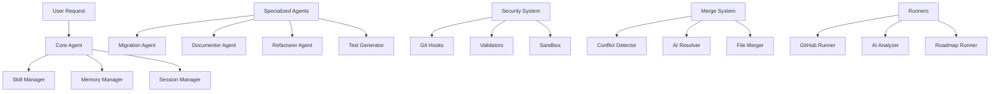
```mermaid
graph TB
    A[User Request] --> B[Core Agent]
    B --> C[Skill Manager]
    B --> D[Memory Manager]
    B --> E[Session Manager]
    
    F[Specialized Agents] --> G[Migration Agent]
    F --> H[Documenter Agent]
    F --> I[Refactorer Agent]
    F --> J[Test Generator]
    
    K[Security System] --> L[Git Hooks]
    K --> M[Validators]
    K --> N[Sandbox]
    
    O[Merge System] --> P[Conflict Detector]
    O --> Q[AI Resolver]
    O --> R[File Merger]
    
    S[Runners] --> T[GitHub Runner]
    S --> U[AI Analyzer]
    S --> V[Roadmap Runner]
```

---

## Agent Principal

### Core Agent
**Fichier** : `apps/backend/core/agent.py`

**Description** : Façade principale qui orchestre tous les modules d'agents refactorisés.

#### Workflow d'Appel

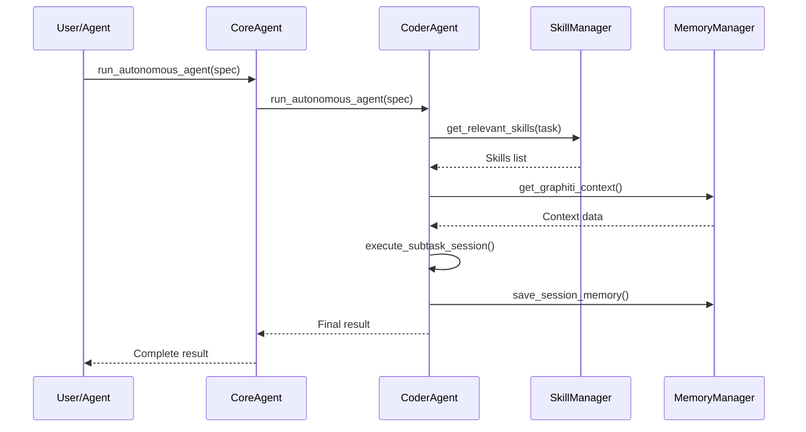
```mermaid
sequenceDiagram
    participant U as User/Agent
    participant CA as CoreAgent
    participant CR as CoderAgent
    participant SM as SkillManager
    participant MM as MemoryManager
    
    U->>CA: run_autonomous_agent(spec)
    CA->>CR: run_autonomous_agent(spec)
    CR->>SM: get_relevant_skills(task)
    SM-->>CR: Skills list
    CR->>MM: get_graphiti_context()
    MM-->>CR: Context data
    CR->>CR: execute_subtask_session()
    CR->>MM: save_session_memory()
    CR-->>CA: Final result
    CA-->>U: Complete result
```

**Modules principaux** :
- `coder.py` : Boucle autonome principale
- `session.py` : Exécution de session
- `memory.py` : Système de mémoire double couche
- `planner.py` : Planification de suivis
- `utils.py` : Opérations Git et gestion de plans

---

## Système de Skills

### 1. Skill Manager
**Fichier** : `apps/backend/skills/skill_manager.py`

**Description** : Gestionnaire de skills avec chargement progressif (3 niveaux).

#### Workflow d'Appel

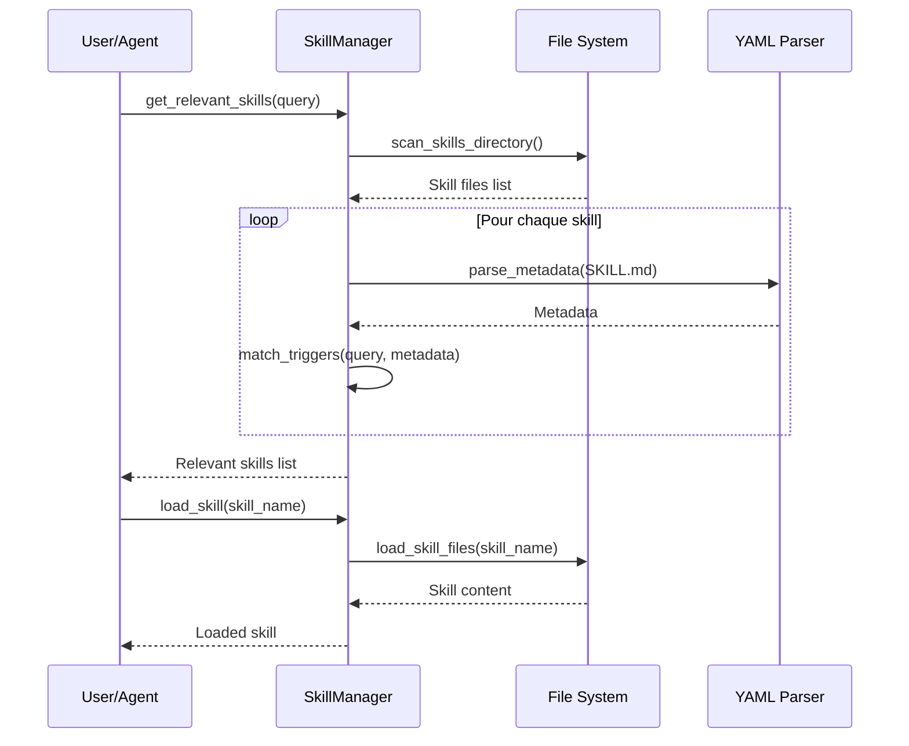
```mermaid
sequenceDiagram
    participant U as User/Agent
    participant SM as SkillManager
    participant FS as File System
    participant YML as YAML Parser
    
    U->>SM: get_relevant_skills(query)
    SM->>FS: scan_skills_directory()
    FS-->>SM: Skill files list
    loop Pour chaque skill
        SM->>YML: parse_metadata(SKILL.md)
        YML-->>SM: Metadata
        SM->>SM: match_triggers(query, metadata)
    end
    SM-->>U: Relevant skills list
    
    U->>SM: load_skill(skill_name)
    SM->>FS: load_skill_files(skill_name)
    FS-->>SM: Skill content
    SM-->>U: Loaded skill
```

**Chargement Progressif (3 niveaux)** :
1. **Niveau 1** : Métadonnées YAML (toujours chargées)
2. **Niveau 2** : Instructions Markdown (chargé au déclenchement)
3. **Niveau 3** : Scripts et ressources (chargé à la demande)

### 2. Framework Migration Skill
**Fichier** : `apps/backend/skills/migration/`

#### Workflow d'Appel

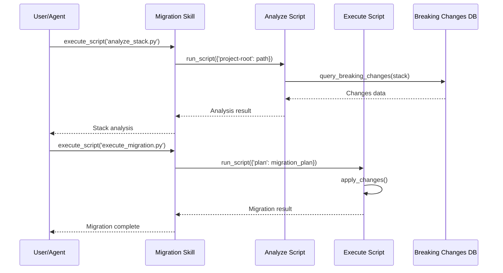
```mermaid
sequenceDiagram
    participant U as User/Agent
    participant MS as Migration Skill
    participant AS as Analyze Script
    participant EM as Execute Script
    participant BC as Breaking Changes DB
    
    U->>MS: execute_script('analyze_stack.py')
    MS->>AS: run_script({'project-root': path})
    AS->>BC: query_breaking_changes(stack)
    BC-->>AS: Changes data
    AS-->>MS: Analysis result
    MS-->>U: Stack analysis
    
    U->>MS: execute_script('execute_migration.py')
    MS->>EM: run_script({'plan': migration_plan})
    EM->>EM: apply_changes()
    EM-->>MS: Migration result
    MS-->>U: Migration complete
```

**Scripts disponibles** :
- `analyze_stack.py` : Analyse du stack technologique
- `execute_migration.py` : Exécution de la migration

**Ressources** :
- `data/breaking_changes.json` : Base de données des changements
- `templates/migration_plan.md` : Template de plan

### 3. Composite Skills
**Fichier** : `apps/backend/skills/composite_skills.py`

#### Workflow d'Appel

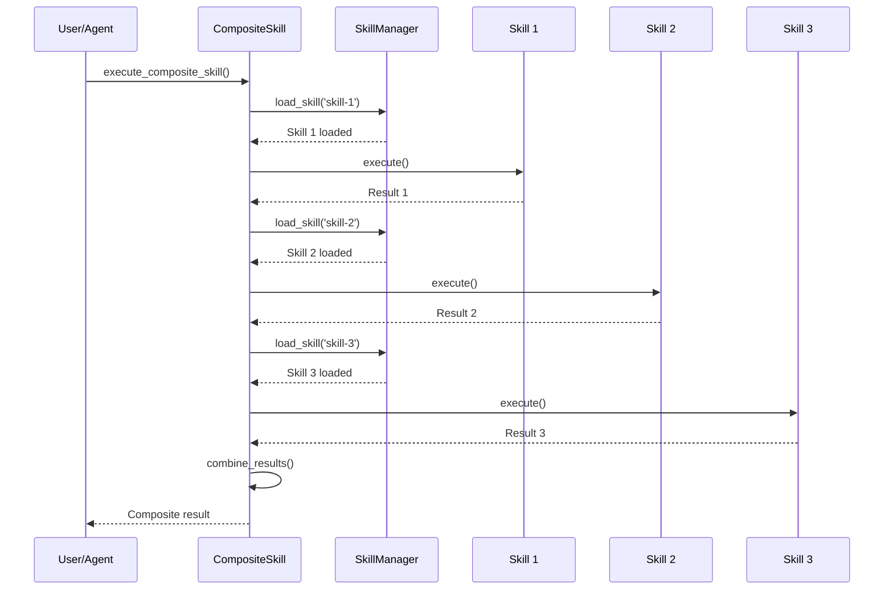
```mermaid
sequenceDiagram
    participant U as User/Agent
    participant CS as CompositeSkill
    participant SM as SkillManager
    participant S1 as Skill 1
    participant S2 as Skill 2
    participant S3 as Skill 3
    
    U->>CS: execute_composite_skill()
    CS->>SM: load_skill('skill-1')
    SM-->>CS: Skill 1 loaded
    CS->>S1: execute()
    S1-->>CS: Result 1
    
    CS->>SM: load_skill('skill-2')
    SM-->>CS: Skill 2 loaded
    CS->>S2: execute()
    S2-->>CS: Result 2
    
    CS->>SM: load_skill('skill-3')
    SM-->>CS: Skill 3 loaded
    CS->>S3: execute()
    S3-->>CS: Result 3
    
    CS->>CS: combine_results()
    CS-->>U: Composite result
```

### 4. Distributed Skills
**Fichier** : `apps/backend/skills/distributed_skills.py`

#### Workflow d'Appel

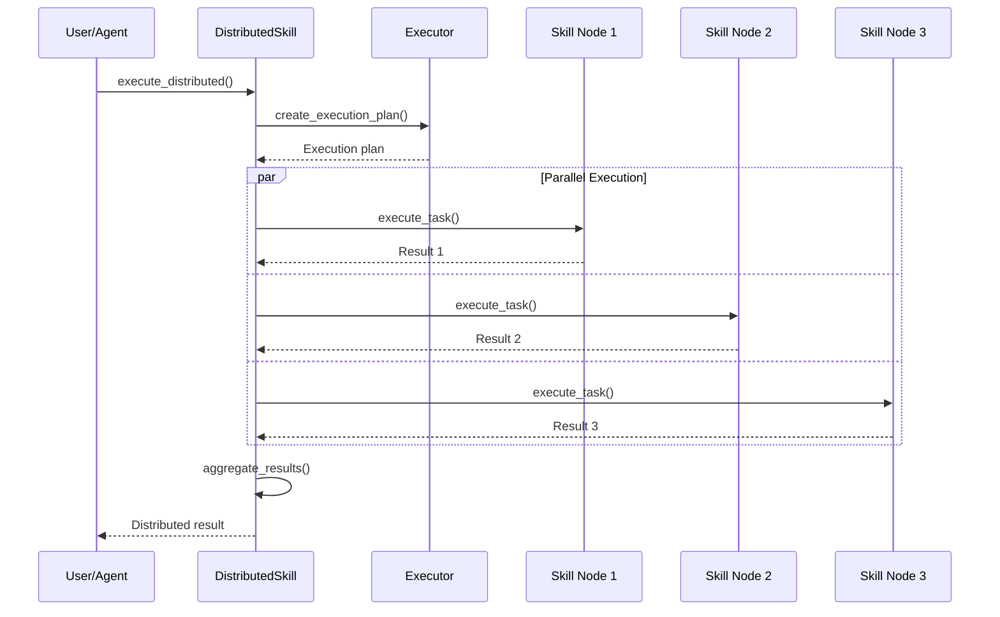
```mermaid
sequenceDiagram
    participant U as User/Agent
    participant DS as DistributedSkill
    participant EX as Executor
    participant S1 as Skill Node 1
    participant S2 as Skill Node 2
    participant S3 as Skill Node 3
    
    U->>DS: execute_distributed()
    DS->>EX: create_execution_plan()
    EX-->>DS: Execution plan
    
    par Parallel Execution
        DS->>S1: execute_task()
        S1-->>DS: Result 1
    and
        DS->>S2: execute_task()
        S2-->>DS: Result 2
    and
        DS->>S3: execute_task()
        S3-->>DS: Result 3
    end
    
    DS->>DS: aggregate_results()
    DS-->>U: Distributed result
```

---

## Agents Spécialisés

### 1. Coder Agent
**Fichier** : `apps/backend/agents/coder.py`

#### Workflow d'Appel

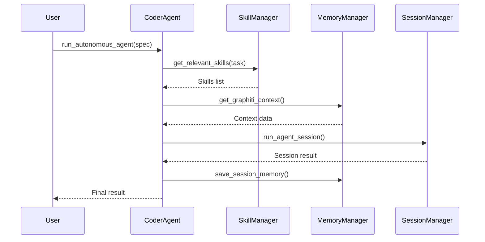
```mermaid
sequenceDiagram
    participant U as User
    participant CA as CoderAgent
    participant SM as SkillManager
    participant MM as MemoryManager
    participant SES as SessionManager
    
    U->>CA: run_autonomous_agent(spec)
    CA->>SM: get_relevant_skills(task)
    SM-->>CA: Skills list
    CA->>MM: get_graphiti_context()
    MM-->>CA: Context data
    CA->>SES: run_agent_session()
    SES-->>CA: Session result
    CA->>MM: save_session_memory()
    CA-->>U: Final result
```

### 2. Migration Agent
**Fichier** : `apps/backend/agents/migration_agent.py`

#### Workflow d'Appel

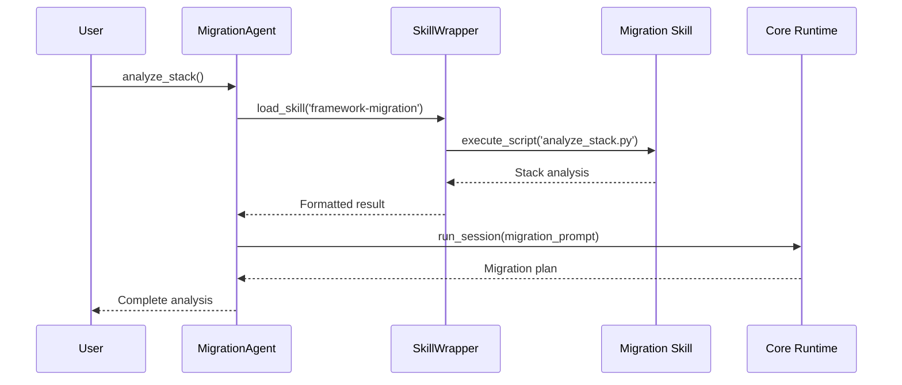
```mermaid
sequenceDiagram
    participant U as User
    participant MA as MigrationAgent
    participant SMW as SkillWrapper
    participant MS as Migration Skill
    participant CR as Core Runtime
    
    U->>MA: analyze_stack()
    MA->>SMW: load_skill('framework-migration')
    SMW->>MS: execute_script('analyze_stack.py')
    MS-->>SMW: Stack analysis
    SMW-->>MA: Formatted result
    MA->>CR: run_session(migration_prompt)
    CR-->>MA: Migration plan
    MA-->>U: Complete analysis
```

### 3. Documenter Agent
**Fichier** : `apps/backend/agents/documenter.py`

#### Workflow d'Appel

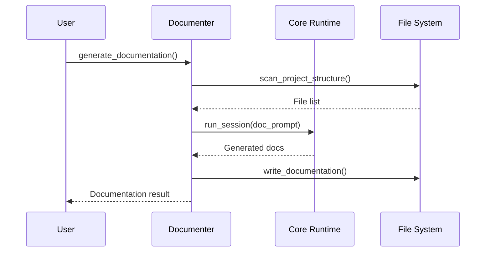
```mermaid
sequenceDiagram
    participant U as User
    participant DA as Documenter
    participant CR as Core Runtime
    participant FS as File System
    
    U->>DA: generate_documentation()
    DA->>FS: scan_project_structure()
    FS-->>DA: File list
    DA->>CR: run_session(doc_prompt)
    CR-->>DA: Generated docs
    DA->>FS: write_documentation()
    DA-->>U: Documentation result
```

### 4. Refactorer Agent
**Fichier** : `apps/backend/agents/refactorer.py`

#### Workflow d'Appel

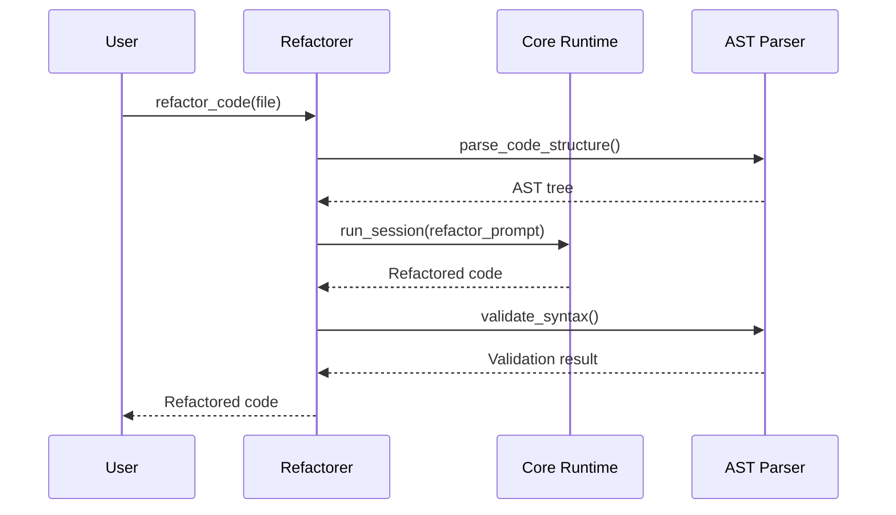
```mermaid
sequenceDiagram
    participant U as User
    participant RA as Refactorer
    participant CR as Core Runtime
    participant AST as AST Parser
    
    U->>RA: refactor_code(file)
    RA->>AST: parse_code_structure()
    AST-->>RA: AST tree
    RA->>CR: run_session(refactor_prompt)
    CR-->>RA: Refactored code
    RA->>AST: validate_syntax()
    AST-->>RA: Validation result
    RA-->>U: Refactored code
```

### 5. Test Generator Agent
**Fichier** : `apps/backend/agents/test_generator.py`

#### Workflow d'Appel

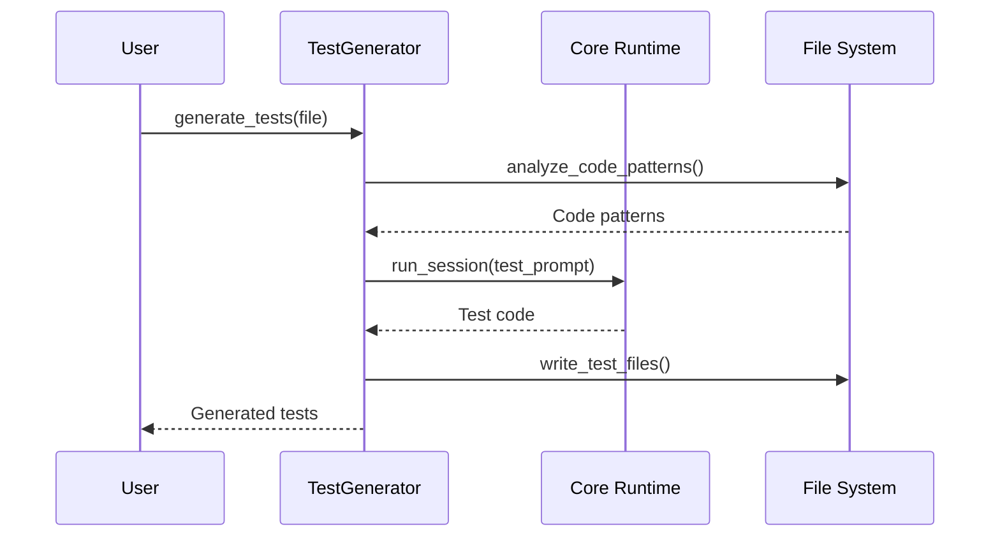
```mermaid
sequenceDiagram
    participant U as User
    participant TG as TestGenerator
    participant CR as Core Runtime
    participant FS as File System
    
    U->>TG: generate_tests(file)
    TG->>FS: analyze_code_patterns()
    FS-->>TG: Code patterns
    TG->>CR: run_session(test_prompt)
    CR-->>TG: Test code
    TG->>FS: write_test_files()
    TG-->>U: Generated tests
```

---

## Services de Support

### 1. Memory Manager
**Fichier** : `apps/backend/agents/memory_manager.py`

#### Workflow d'Appel

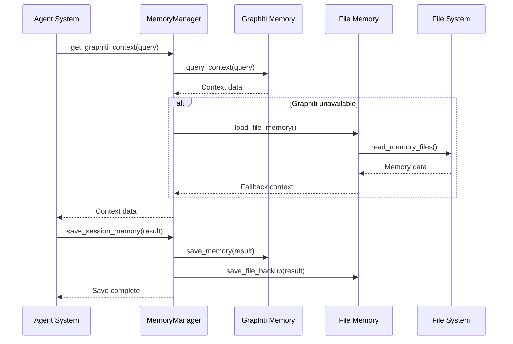
```mermaid
sequenceDiagram
    participant U as Agent System
    participant MM as MemoryManager
    participant GM as Graphiti Memory
    participant FM as File Memory
    participant FS as File System
    
    U->>MM: get_graphiti_context(query)
    MM->>GM: query_context(query)
    GM-->>MM: Context data
    
    alt Graphiti unavailable
        MM->>FM: load_file_memory()
        FM->>FS: read_memory_files()
        FS-->>FM: Memory data
        FM-->>MM: Fallback context
    end
    
    MM-->>U: Context data
    
    U->>MM: save_session_memory(result)
    MM->>GM: save_memory(result)
    MM->>FM: save_file_backup(result)
    MM-->>U: Save complete
```

### 2. Session Manager
**Fichier** : `apps/backend/agents/session.py`

#### Workflow d'Appel

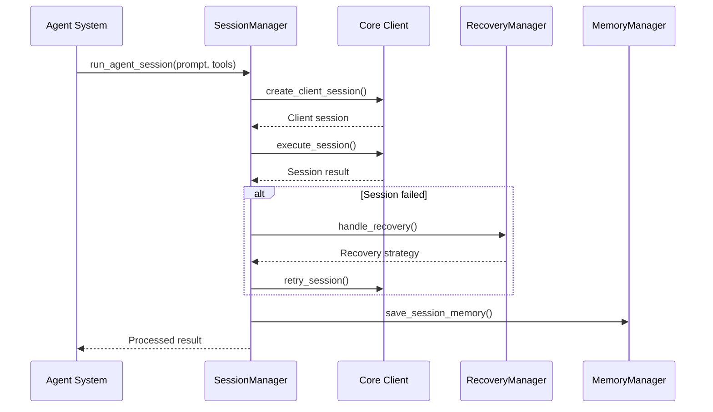
```mermaid
sequenceDiagram
    participant U as Agent System
    participant SM as SessionManager
    participant CC as Core Client
    participant RM as RecoveryManager
    participant MM as MemoryManager
    
    U->>SM: run_agent_session(prompt, tools)
    SM->>CC: create_client_session()
    CC-->>SM: Client session
    SM->>CC: execute_session()
    CC-->>SM: Session result
    
    alt Session failed
        SM->>RM: handle_recovery()
        RM-->>SM: Recovery strategy
        SM->>CC: retry_session()
    end
    
    SM->>MM: save_session_memory()
    SM-->>U: Processed result
```

### 3. Follow-up Planner
**Fichier** : `apps/backend/agents/planner.py`

#### Workflow d'Appel

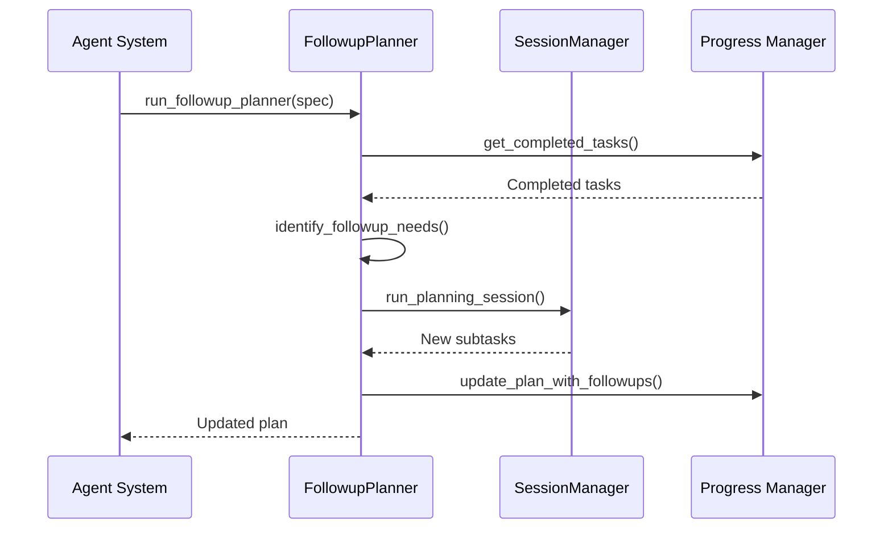
```mermaid
sequenceDiagram
    participant U as Agent System
    participant FP as FollowupPlanner
    participant SM as SessionManager
    participant PM as Progress Manager
    
    U->>FP: run_followup_planner(spec)
    FP->>PM: get_completed_tasks()
    PM-->>FP: Completed tasks
    FP->>FP: identify_followup_needs()
    FP->>SM: run_planning_session()
    SM-->>FP: New subtasks
    FP->>PM: update_plan_with_followups()
    FP-->>U: Updated plan
```

---

## Hooks et Intégrations

### 1. Git Hooks
**Fichier** : `apps/backend/security/git_hooks.py`

#### Workflow d'Appel

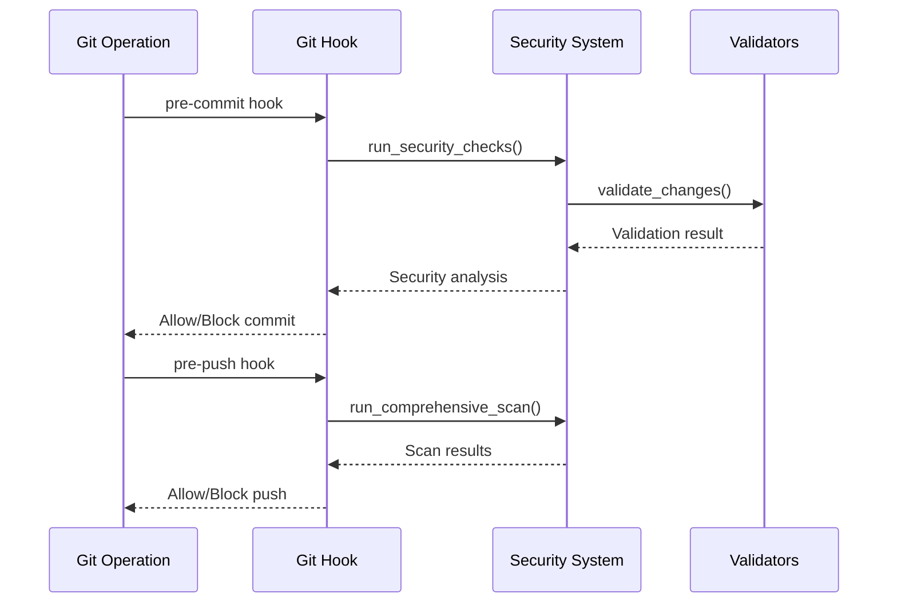
```mermaid
sequenceDiagram
    participant GIT as Git Operation
    participant GH as Git Hook
    participant SEC as Security System
    participant VAL as Validators
    
    GIT->>GH: pre-commit hook
    GH->>SEC: run_security_checks()
    SEC->>VAL: validate_changes()
    VAL-->>SEC: Validation result
    SEC-->>GH: Security analysis
    GH-->>GIT: Allow/Block commit
    
    GIT->>GH: pre-push hook
    GH->>SEC: run_comprehensive_scan()
    SEC-->>GH: Scan results
    GH-->>GIT: Allow/Block push
```

### 2. Security Hooks
**Fichier** : `apps/backend/security/hooks.py`

#### Workflow d'Appel

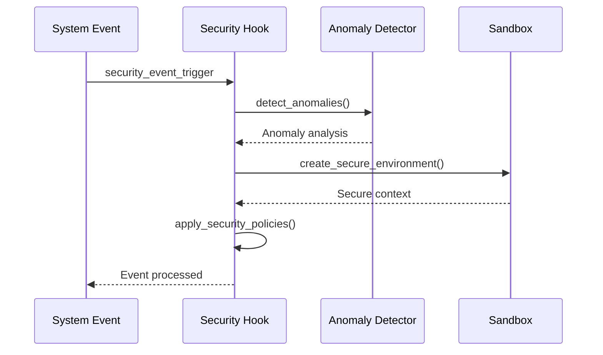
```mermaid
sequenceDiagram
    participant SYS as System Event
    participant SH as Security Hook
    participant AO as Anomaly Detector
    participant SA as Sandbox
    
    SYS->>SH: security_event_trigger
    SH->>AO: detect_anomalies()
    AO-->>SH: Anomaly analysis
    SH->>SA: create_secure_environment()
    SA-->>SH: Secure context
    SH->>SH: apply_security_policies()
    SH-->>SYS: Event processed
```

### 3. Merge Hooks
**Fichier** : `apps/backend/merge/install_hook.py`

#### Workflow d'Appel

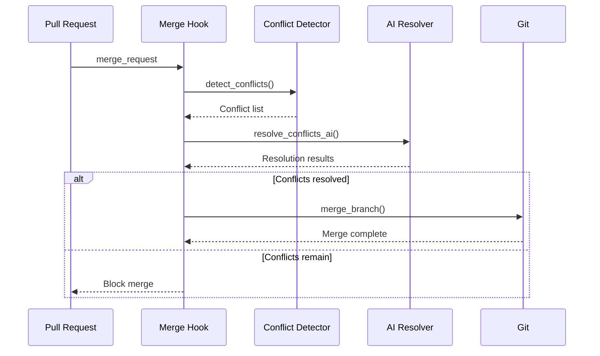
```mermaid
sequenceDiagram
    participant PR as Pull Request
    participant MH as Merge Hook
    participant CD as Conflict Detector
    participant AR as AI Resolver
    participant GIT as Git
    
    PR->>MH: merge_request
    MH->>CD: detect_conflicts()
    CD-->>MH: Conflict list
    MH->>AR: resolve_conflicts_ai()
    AR-->>MH: Resolution results
    
    alt Conflicts resolved
        MH->>GIT: merge_branch()
        GIT-->>MH: Merge complete
    else Conflicts remain
        MH-->>PR: Block merge
    end
```

---

## Sécurité

### 1. Security Orchestrator
**Fichier** : `apps/backend/security/security_orchestrator.py`

#### Workflow d'Appel

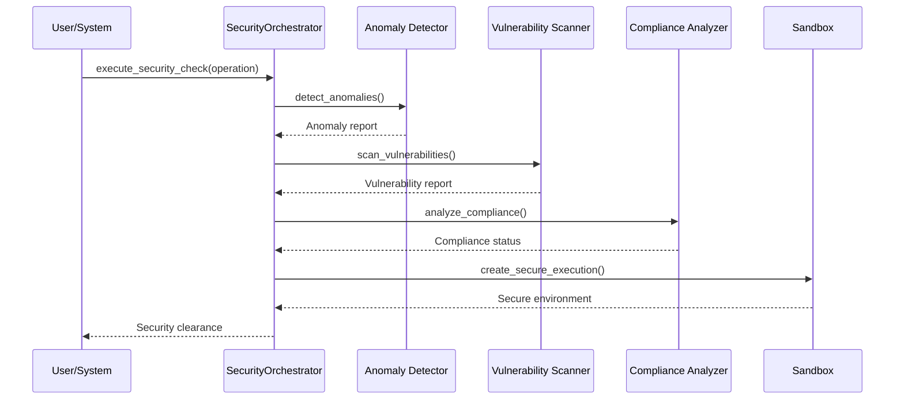
```mermaid
sequenceDiagram
    participant U as User/System
    participant SO as SecurityOrchestrator
    participant AD as Anomaly Detector
    participant VS as Vulnerability Scanner
    participant CS as Compliance Analyzer
    participant SB as Sandbox
    
    U->>SO: execute_security_check(operation)
    SO->>AD: detect_anomalies()
    AD-->>SO: Anomaly report
    SO->>VS: scan_vulnerabilities()
    VS-->>SO: Vulnerability report
    SO->>CS: analyze_compliance()
    CS-->>SO: Compliance status
    SO->>SB: create_secure_execution()
    SB-->>SO: Secure environment
    SO-->>U: Security clearance
```

### 2. Sandbox System
**Fichier** : `apps/backend/security/sandbox.py`

#### Workflow d'Appel

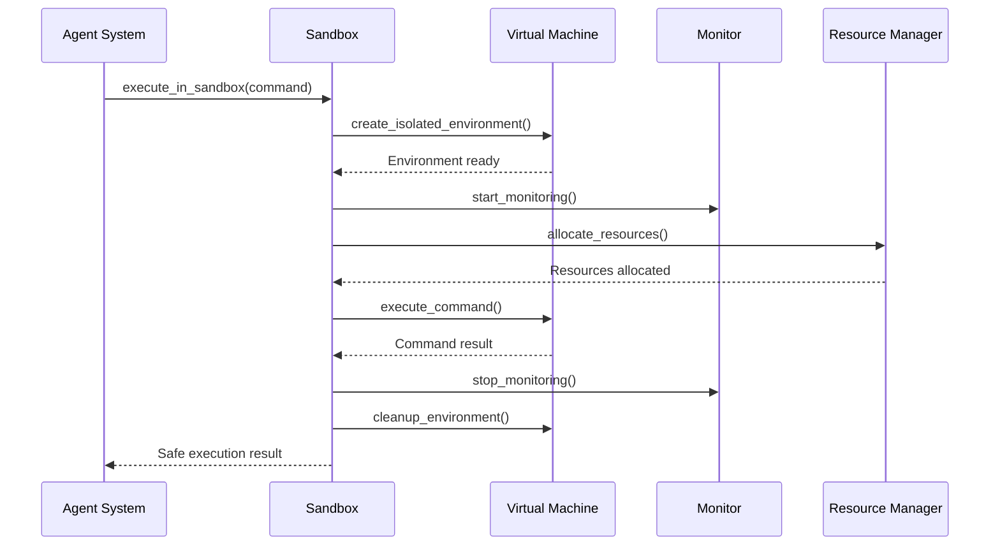
```mermaid
sequenceDiagram
    participant U as Agent System
    participant SB as Sandbox
    participant VM as Virtual Machine
    participant MON as Monitor
    participant RES as Resource Manager
    
    U->>SB: execute_in_sandbox(command)
    SB->>VM: create_isolated_environment()
    VM-->>SB: Environment ready
    SB->>MON: start_monitoring()
    SB->>RES: allocate_resources()
    RES-->>SB: Resources allocated
    SB->>VM: execute_command()
    VM-->>SB: Command result
    SB->>MON: stop_monitoring()
    SB->>VM: cleanup_environment()
    SB-->>U: Safe execution result
```

### 3. Validators Registry
**Fichier** : `apps/backend/security/validator_registry.py`

#### Workflow d'Appel

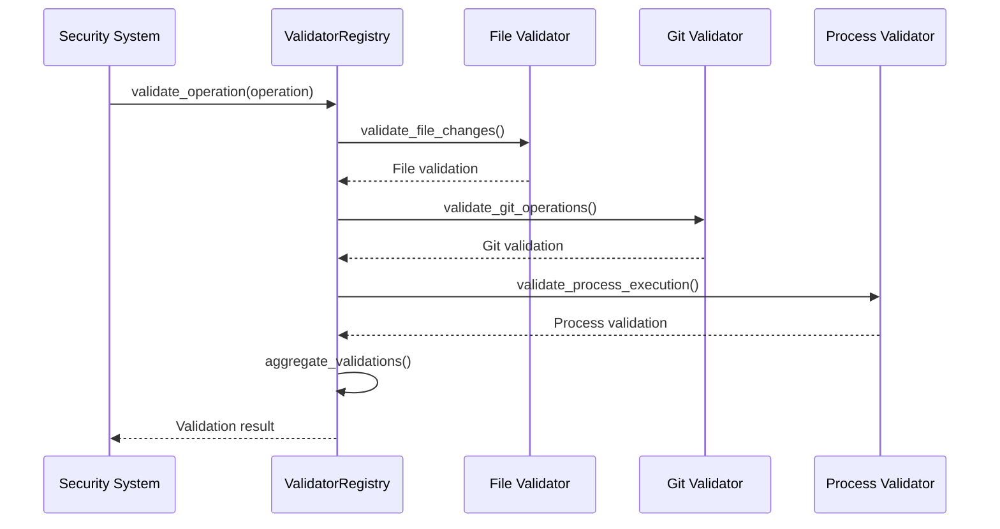
```mermaid
sequenceDiagram
    participant U as Security System
    participant VR as ValidatorRegistry
    participant FV as File Validator
    participant GV as Git Validator
    participant PV as Process Validator
    
    U->>VR: validate_operation(operation)
    VR->>FV: validate_file_changes()
    FV-->>VR: File validation
    VR->>GV: validate_git_operations()
    GV-->>VR: Git validation
    VR->>PV: validate_process_execution()
    PV-->>VR: Process validation
    VR->>VR: aggregate_validations()
    VR-->>U: Validation result
```

---

## Merge System

### 1. Merge Orchestrator
**Fichier** : `apps/backend/merge/orchestrator.py`

#### Workflow d'Appel

```mermaid
sequenceDiagram
    participant U as User/System
    participant MO as MergeOrchestrator
    participant CD as Conflict Detector
    participant AR as AI Resolver
    participant FM as File Merger
    participant FT as File Timeline
    
    U->>MO: process_merge_request()
    MO->>CD: detect_conflicts()
    CD-->>MO: Conflict analysis
    MO->>AR: resolve_with_ai()
    AR-->>MO: AI resolutions
    MO->>FM: merge_files()
    FM-->>MO: Merge results
    MO->>FT: update_timeline()
    FT-->>MO: Timeline updated
    MO-->>U: Merge complete
```

### 2. Conflict Detector
**Fichier** : `apps/backend/merge/conflict_detector.py`

#### Workflow d'Appel

```mermaid
sequenceDiagram
    participant U as Merge Orchestrator
    participant CD as ConflictDetector
    participant GIT as Git
    participant SA as Semantic Analyzer
    
    U->>CD: analyze_conflicts(branch1, branch2)
    CD->>GIT: get_diff_summary()
    GIT-->>CD: Diff data
    CD->>GIT: get_conflicted_files()
    GIT-->>CD: Conflicted files
    loop Pour chaque fichier
        CD->>SA: analyze_semantic_conflicts()
        SA-->>CD: Semantic analysis
    end
    CD->>CD: categorize_conflicts()
    CD-->>U: Conflict report
```

### 3. AI Resolver
**Fichier** : `apps/backend/merge/ai_resolver.py`

#### Workflow d'Appel

```mermaid
sequenceDiagram
    participant U as Merge Orchestrator
    participant AR as AIResolver
    participant CC as Core Client
    participant FM as File Merger
    
    U->>AR: resolve_conflicts(conflicts)
    AR->>CC: create_resolution_session()
    CC-->>AR: Resolution session
    AR->>CC: analyze_conflicts_with_ai()
    CC-->>AR: AI analysis
    AR->>FM: apply_ai_resolutions()
    FM-->>AR: Resolution results
    AR->>AR: validate_resolutions()
    AR-->>U: Resolved conflicts
```

---

## Runners Externes

### 1. GitHub Runner
**Fichier** : `apps/backend/runners/github/`

#### Workflow d'Appel

```mermaid
sequenceDiagram
    participant U as External Trigger
    participant GHR as GitHubRunner
    participant GO as GitHubOrchestrator
    participant PRE as PRReviewEngine
    participant TE as TriageEngine
    
    U->>GHR: github_webhook_event()
    GHR->>GO: process_event()
    GO->>PRE: review_pr()
    PRE-->>GO: Review results
    GO->>TE: triage_issues()
    TE-->>GO: Triage results
    GO-->>GHR: Processing complete
    GHR-->>U: Webhook response
```

### 2. AI Analyzer Runner
**Fichier** : `apps/backend/runners/ai_analyzer_runner.py`

#### Workflow d'Appel

```mermaid
sequenceDiagram
    participant U as User/System
    participant AAR as AIAnalyzerRunner
    participant AA as AIAnalyzer
    participant CC as Core Client
    participant FS as File System
    
    U->>AAR: analyze_codebase()
    AAR->>AA: start_analysis()
    AA->>FS: scan_codebase()
    FS-->>AA: File list
    AA->>CC: analyze_with_ai()
    CC-->>AA: AI insights
    AA->>AA: generate_report()
    AA-->>AAR: Analysis report
    AAR-->>U: Complete analysis
```

### 3. Roadmap Runner
**Fichier** : `apps/backend/runners/roadmap_runner.py`

#### Workflow d'Appel

```mermaid
sequenceDiagram
    participant U as User/System
    participant RR as RoadmapRunner
    participant RM as RoadmapManager
    participant CC as Core Client
    participant PM as Progress Manager
    
    U->>RR: generate_roadmap(spec)
    RR->>RM: analyze_requirements()
    RM-->>RR: Requirements analysis
    RR->>CC: create_roadmap_with_ai()
    CC-->>RR: AI-generated roadmap
    RR->>PM: track_roadmap_progress()
    PM-->>RR: Progress data
    RR-->>U: Complete roadmap
```

---

## Optimisation et Performance

### 1. Token Optimizer
**Fichier** : `apps/backend/skills/token_optimizer.py`

#### Workflow d'Appel

```mermaid
sequenceDiagram
    participant U as Agent System
    participant TO as TokenOptimizer
    participant ANAL as Analyzer
    participant CACHE as Token Cache
    
    U->>TO: optimize_tokens(content)
    TO->>ANAL: analyze_token_usage()
    ANAL-->>TO: Usage patterns
    TO->>CACHE: check_cached_optimization()
    CACHE-->>TO: Cached result
    
    alt No cache hit
        TO->>TO: apply_optimization_strategies()
        TO->>CACHE: cache_optimization()
    end
    
    TO-->>U: Optimized content
```

### 2. Context Optimizer
**Fichier** : `apps/backend/skills/context_optimizer.py`

#### Workflow d'Appel

```mermaid
sequenceDiagram
    participant U as Agent System
    participant CO as ContextOptimizer
    participant REL as Relevance Engine
    participant COMP as Compression
    
    U->>CO: optimize_context(context, query)
    CO->>REL: calculate_relevance_scores()
    REL-->>CO: Relevance scores
    CO->>CO: select_high_relevance_items()
    CO->>COMP: compress_context()
    COMP-->>CO: Compressed context
    CO-->>U: Optimized context
```

### 3. Predictive Cache
**Fichier** : `apps/backend/skills/predictive_cache.py`

#### Workflow d'Appel

```mermaid
sequenceDiagram
    participant U as Agent System
    participant PC as PredictiveCache
    participant ML as ML Predictor
    participant CACHE as Cache Storage
    
    U->>PC: get_cached_result(query)
    PC->>CACHE: check_cache()
    CACHE-->>PC: Cache result
    
    alt Cache hit
        PC-->>U: Cached result
    else Cache miss
        PC->>ML: predict_future_queries()
        ML-->>PC: Predictions
        PC->>CACHE: preload_predictions()
        PC-->>U: Cache miss
    end
```

### 4. Skill Metrics
**Fichier** : `apps/backend/skills/skill_metrics.py`

#### Workflow d'Appel

```mermaid
sequenceDiagram
    participant U as Agent System
    participant SM as SkillMetrics
    participant MET as Metrics Store
    participant ANAL as Analytics Engine
    
    U->>SM: track_skill_usage(skill, result)
    SM->>MET: record_usage()
    MET-->>SM: Recorded
    
    U->>SM: get_skill_metrics()
    SM->>MET: query_metrics()
    MET-->>SM: Raw metrics
    SM->>ANAL: analyze_metrics()
    ANAL-->>SM: Analytics
    SM-->>U: Metrics report
```

---

## Workflows d'Appel Complets

### Workflow 1 : Session de Codage Autonome

```mermaid
sequenceDiagram
    participant U as User
    participant CA as CoreAgent
    participant CR as CoderAgent
    participant SM as SkillManager
    participant MM as MemoryManager
    participant SES as SessionManager
    
    U->>CA: run_autonomous_agent(spec)
    CA->>CR: run_autonomous_agent(spec)
    CR->>SM: get_relevant_skills(spec)
    SM-->>CR: relevant_skills
    CR->>MM: get_graphiti_context(spec)
    MM-->>CR: context_data
    CR->>SES: run_agent_session(prompt, tools)
    SES-->>CR: session_result
    CR->>MM: save_session_memory(result)
    CR-->>CA: final_result
    CA-->>U: complete_result
```

### Workflow 2 : Migration de Framework avec Skills

```mermaid
sequenceDiagram
    participant U as User
    participant MA as MigrationAgent
    participant SM as SkillManager
    participant MS as Migration Skill
    participant CR as Core Runtime
    participant MM as MemoryManager
    
    U->>MA: migrate_framework(from, to)
    MA->>SM: load_skill('framework-migration')
    SM->>MS: execute_script('analyze_stack.py')
    MS-->>SM: stack_analysis
    SM-->>MA: formatted_analysis
    MA->>CR: run_session(migration_prompt)
    CR-->>MA: migration_plan
    MA->>MS: execute_script('execute_migration.py')
    MS-->>MA: migration_result
    MA->>MM: save_migration_memory()
    MA-->>U: migration_complete
```

### Workflow 3 : Review de Code avec Sécurité

```mermaid
sequenceDiagram
    participant U as User/System
    participant RA as RefactorerAgent
    participant SEC as Security System
    participant VAL as Validators
    participant CR as Core Runtime
    participant SB as Sandbox
    
    U->>RA: refactor_with_security(file)
    RA->>SEC: run_security_analysis()
    SEC->>VAL: validate_changes()
    VAL-->>SEC: validation_result
    SEC->>SB: create_secure_environment()
    SB-->>SEC: secure_context
    SEC-->>RA: security_clearance
    RA->>CR: run_session(refactor_prompt)
    CR-->>RA: refactored_code
    RA->>SEC: final_security_check()
    SEC-->>RA: security_approval
    RA-->>U: secure_refactored_code
```

### Workflow 4 : Merge Intelligent avec IA

```mermaid
sequenceDiagram
    participant U as Pull Request
    participant MO as MergeOrchestrator
    participant CD as ConflictDetector
    participant AR as AIResolver
    participant FM as FileMerger
    participant SEC as Security System
    
    U->>MO: merge_request
    MO->>CD: detect_conflicts()
    CD-->>MO: conflict_list
    MO->>AR: resolve_with_ai()
    AR->>SEC: validate_resolution_security()
    SEC-->>AR: security_approval
    AR-->>MO: ai_resolutions
    MO->>FM: apply_resolutions()
    FM-->>MO: merge_result
    MO->>SEC: final_merge_security_check()
    SEC-->>MO: merge_approval
    MO-->>U: merge_complete
```

### Workflow 5 : Analyse de Codebase Complète

```mermaid
sequenceDiagram
    participant U as User
    participant AAR as AIAnalyzerRunner
    participant AA as AIAnalyzer
    participant SM as SkillManager
    participant CR as Core Runtime
    participant TO as TokenOptimizer
    
    U->>AAR: analyze_codebase()
    AAR->>AA: start_analysis()
    AA->>SM: get_analysis_skills()
    SM-->>AA: analysis_skills
    AA->>TO: optimize_analysis_context()
    TO-->>AA: optimized_context
    AA->>CR: run_analysis_sessions()
    CR-->>AA: analysis_results
    AA->>AA: generate_comprehensive_report()
    AA-->>AAR: complete_analysis
    AAR-->>U: analysis_report
```

### Workflow 6 : Gestion de Mémoire Multi-Couche

```mermaid
sequenceDiagram
    participant U as Agent System
    participant MM as MemoryManager
    participant GM as Graphiti Memory
    participant FM as File Memory
    participant SM as SkillManager
    participant CC as Core Client
    
    U->>MM: get_context_for_task(query)
    MM->>GM: query_graphiti_context()
    GM-->>MM: graphiti_context
    
    alt Graphiti unavailable
        MM->>FM: load_file_memory()
        FM-->>MM: file_context
    end
    
    MM->>SM: enrich_with_skill_context()
    SM-->>MM: skill_context
    MM->>CC: validate_context_relevance()
    CC-->>MM: validation_result
    MM-->>U: enriched_context
    
    U->>MM: save_task_result(result)
    MM->>GM: save_to_graphiti()
    MM->>FM: save_file_backup()
    MM-->>U: save_complete
```

### Workflow 7 : Pipeline d'Optimisation

```mermaid
sequenceDiagram
    participant U as Agent System
    participant TO as TokenOptimizer
    participant CO as ContextOptimizer
    participant PC as PredictiveCache
    participant SM as SkillManager
    participant MET as SkillMetrics
    
    U->>TO: optimize_execution_pipeline()
    TO->>CO: optimize_context_usage()
    CO-->>TO: optimized_context
    TO->>PC: check_prediction_cache()
    PC-->>TO: cached_predictions
    TO->>SM: execute_optimized_skills()
    SM-->>TO: execution_results
    TO->>MET: record_optimization_metrics()
    MET-->>TO: metrics_recorded
    TO->>PC: update_prediction_model()
    PC-->>TO: model_updated
    TO-->>U: optimization_complete
```

---

## Conclusion

Cette architecture complète de Claude Code intègre :

- **Agent principal** : Core Agent avec modules refactorisés (coder, session, memory, planner)
- **Système de skills** : Architecture modulaire avec chargement progressif (3 niveaux)
- **Agents spécialisés** : 5+ agents pour différentes tâches (migration, documentation, refactoring, tests)
- **Services de support** : Memory manager double couche, session manager, follow-up planner
- **Sécurité complète** : Orchestrator, sandbox, validators, anomaly detection
- **Merge system** : Détection et résolution intelligente de conflits avec IA
- **Runners externes** : Integration GitHub, AI analyzer, roadmap generator
- **Optimisation avancée** : Token optimizer, context optimizer, cache prédictif
- **Monitoring** : Métriques complètes et analytics des skills

Le système supporte des workflows complexes allant du codage autonome sécurisé à la migration de frameworks en passant par le merge intelligent, le tout optimisé pour les performances, la sécurité et la maintenabilité.

L'architecture modulaire permet une extensibilité facile et une maintenance simplifiée, tout en maintenant une compatibilité ascendante complète avec les interfaces existantes.
