# GitHub Copilot - Architecture Complète et Workflows

Ce document décrit l'architecture complète du provider GitHub Copilot dans la gestion des tâches, avec tous les agents IA, skills, hooks et workflows d'appel.

## Table des Matières

1. [Overview Architecture](#overview-architecture)
2. [Runtime Principal](#runtime-principal)
3. [Client Agent](#client-agent)
4. [Provider Registry](#provider-registry)
5. [Connecteur d'Usage](#connecteur-dusage)
6. [Agents Spécialisés](#agents-spécialisés)
7. [Skills System](#skills-system)
8. [Services de Support](#services-de-support)
9. [Hooks et Intégrations](#hooks-et-intégrations)
10. [Outils et Utilitaires](#outils-et-utilitaires)
11. [Frontend Integration](#frontend-integration)
12. [Workflows d'Appel](#workflows-dappel)

---

## Overview Architecture

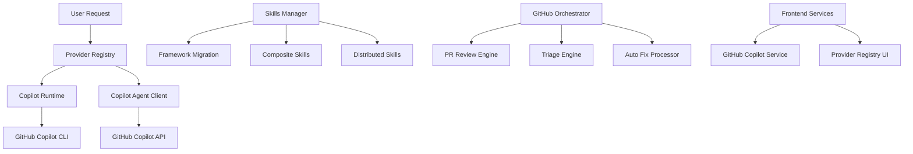
```mermaid
graph TB
    A[User Request] --> B[Provider Registry]
    B --> C[Copilot Runtime]
    B --> D[Copilot Agent Client]
    C --> E[GitHub Copilot CLI]
    D --> F[GitHub Copilot API]
    
    G[Skills Manager] --> H[Framework Migration]
    G --> I[Composite Skills]
    G --> J[Distributed Skills]
    
    K[GitHub Orchestrator] --> L[PR Review Engine]
    K --> M[Triage Engine]
    K --> N[Auto Fix Processor]
    
    O[Frontend Services] --> P[GitHub Copilot Service]
    O --> Q[Provider Registry UI]
```

---

## Runtime Principal

### CopilotRuntime
**Fichier** : `apps/backend/core/runtimes/copilot_runtime.py`

**Description** : Interface principale pour exécuter des sessions GitHub Copilot via CLI.

#### Workflow d'Appel

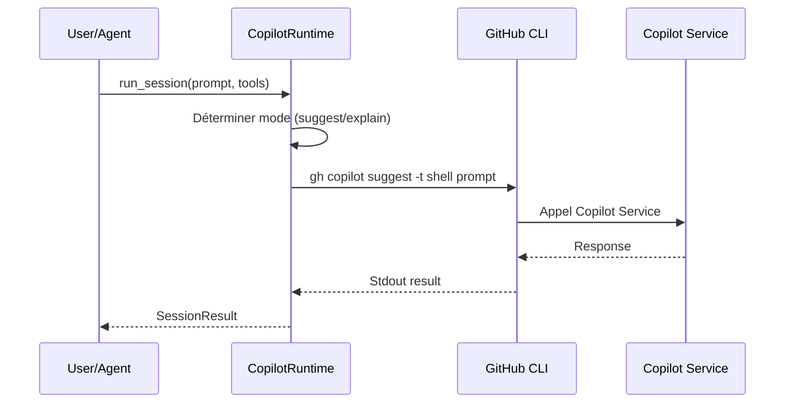
```mermaid
sequenceDiagram
    participant U as User/Agent
    participant CR as CopilotRuntime
    participant GH as GitHub CLI
    participant CP as Copilot Service
    
    U->>CR: run_session(prompt, tools)
    CR->>CR: Déterminer mode (suggest/explain)
    CR->>GH: gh copilot suggest -t shell prompt
    GH->>CP: Appel Copilot Service
    CP-->>GH: Response
    GH-->>CR: Stdout result
    CR-->>U: SessionResult
```

**Méthodes principales** :
- `run_session()` : Exécute une session Copilot
- `stream_session()` : Streaming de réponse (fallback sur run_session)
- `_invoke_copilot()` : Appel CLI `gh copilot`

**Configuration** :
- `gh_path` : Chemin vers GitHub CLI
- `max_turns` : Nombre maximum de tours (10)
- `cli_thinking` : Option de réflexion CLI

---

## Client Agent

### CopilotAgentClient
**Fichier** : `apps/backend/core/agent_client.py`

**Description** : Client abstrait pour l'API Models GitHub Copilot (OpenAI-compatible).

#### Workflow d'Appel

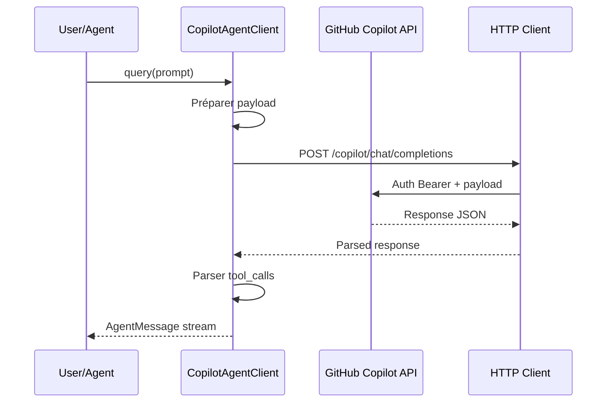
```mermaid
sequenceDiagram
    participant U as User/Agent
    participant CAC as CopilotAgentClient
    participant API as GitHub Copilot API
    participant HTTP as HTTP Client
    
    U->>CAC: query(prompt)
    CAC->>CAC: Préparer payload
    CAC->>HTTP: POST /copilot/chat/completions
    HTTP->>API: Auth Bearer + payload
    API-->>HTTP: Response JSON
    HTTP-->>CAC: Parsed response
    CAC->>CAC: Parser tool_calls
    CAC-->>U: AgentMessage stream
```

**Endpoint API** : `https://api.github.com/copilot/chat/completions`

**Méthodes principales** :
- `query()` : Met en file la requête
- `receive_response()` : Exécute et stream la réponse
- `run_subagents()` : Exécute des sous-agents parallèles

**Authentification** : `GITHUB_TOKEN` avec scope Copilot

---

## Provider Registry

### ProviderRegistry
**Fichier** : `apps/backend/services/provider_registry.py`

**Description** : Enregistrement et gestion des providers LLM.

#### Workflow d'Appel

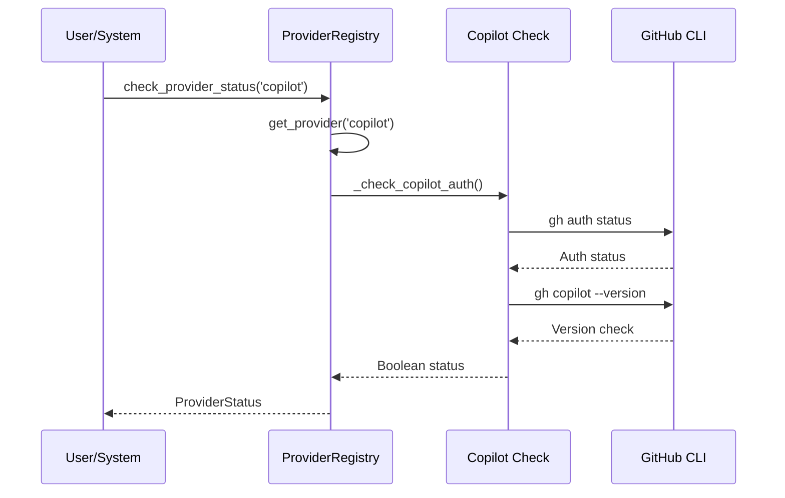
```mermaid
sequenceDiagram
    participant U as User/System
    participant PR as ProviderRegistry
    participant CP as Copilot Check
    participant GH as GitHub CLI
    
    U->>PR: check_provider_status('copilot')
    PR->>PR: get_provider('copilot')
    PR->>CP: _check_copilot_auth()
    CP->>GH: gh auth status
    GH-->>CP: Auth status
    CP->>GH: gh copilot --version
    GH-->>CP: Version check
    CP-->>PR: Boolean status
    PR-->>U: ProviderStatus
```

**Modèles Copilot disponibles** :
- `gpt-4o` (flagship)
- `claude-3.5-sonnet` (standard)
- `o3-mini` (standard, thinking)
- `gpt-4o-mini` (fast)

**Configuration** :
- `requires_cli: true`
- `requires_api_key: false`
- `requires_oauth: false`

---

## Connecteur d'Usage

### CopilotUsageConnector
**Fichier** : `src/connectors/llm_copilot.py`

**Description** : Récupération des métriques d'utilisation GitHub Copilot.

#### Workflow d'Appel

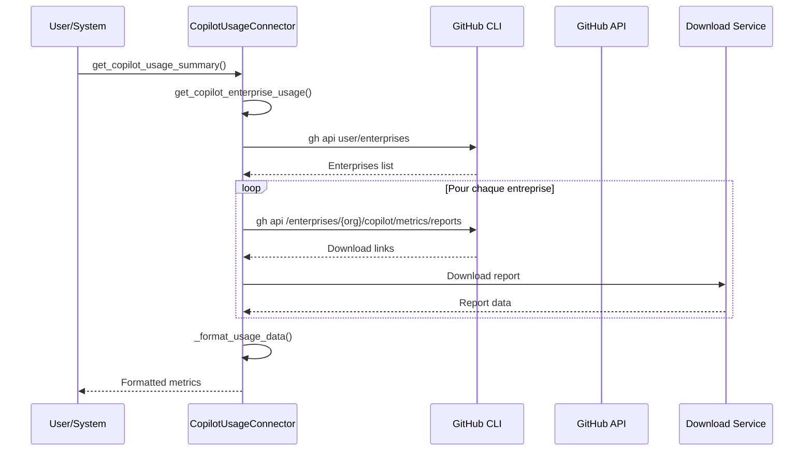
```mermaid
sequenceDiagram
    participant U as User/System
    participant CUC as CopilotUsageConnector
    participant GH as GitHub CLI
    participant API as GitHub API
    participant DL as Download Service
    
    U->>CUC: get_copilot_usage_summary()
    CUC->>CUC: get_copilot_enterprise_usage()
    CUC->>GH: gh api user/enterprises
    GH-->>CUC: Enterprises list
    loop Pour chaque entreprise
        CUC->>GH: gh api /enterprises/{org}/copilot/metrics/reports
        GH-->>CUC: Download links
        CUC->>DL: Download report
        DL-->>CUC: Report data
    end
    CUC->>CUC: _format_usage_data()
    CUC-->>U: Formatted metrics
```

**Méthodes principales** :
- `get_copilot_enterprise_usage()` : Métriques entreprise
- `get_copilot_organization_usage()` : Métriques organisation
- `get_copilot_usage_summary()` : Résumé automatique

**Fallback** : Enterprise → Organisation → Erreur

---

## Agents Spécialisés

### 1. Autonomous Agent
**Fichier** : `apps/backend/agents/coder.py`

#### Workflow d'Appel

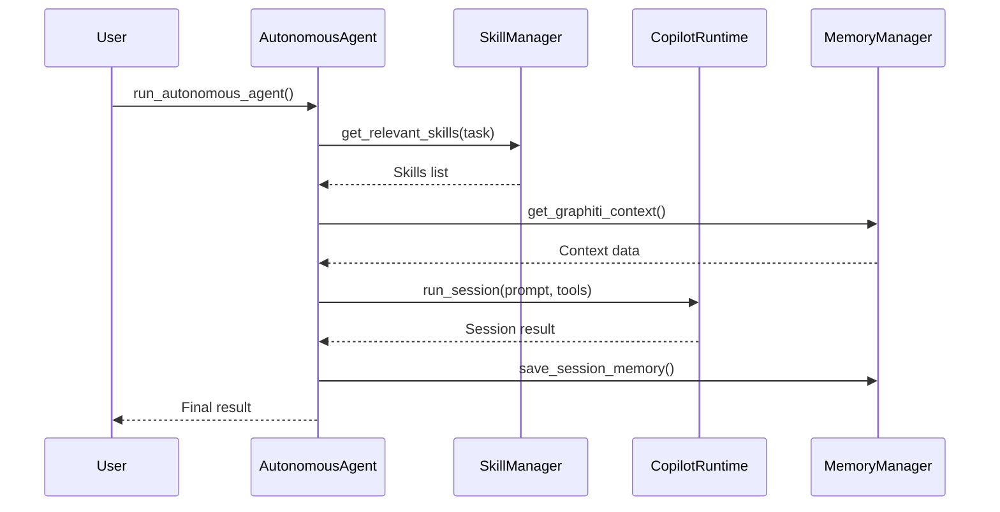
```mermaid
sequenceDiagram
    participant U as User
    participant AA as AutonomousAgent
    participant SM as SkillManager
    participant CR as CopilotRuntime
    participant MM as MemoryManager
    
    U->>AA: run_autonomous_agent()
    AA->>SM: get_relevant_skills(task)
    SM-->>AA: Skills list
    AA->>MM: get_graphiti_context()
    MM-->>AA: Context data
    AA->>CR: run_session(prompt, tools)
    CR-->>AA: Session result
    AA->>MM: save_session_memory()
    AA-->>U: Final result
```

### 2. Migration Agent
**Fichier** : `apps/backend/agents/migration_agent.py`

#### Workflow d'Appel

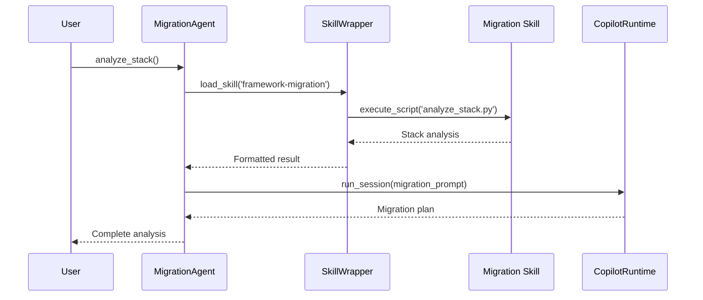
```mermaid
sequenceDiagram
    participant U as User
    participant MA as MigrationAgent
    participant SMW as SkillWrapper
    participant MS as Migration Skill
    participant CR as CopilotRuntime
    
    U->>MA: analyze_stack()
    MA->>SMW: load_skill('framework-migration')
    SMW->>MS: execute_script('analyze_stack.py')
    MS-->>SMW: Stack analysis
    SMW-->>MA: Formatted result
    MA->>CR: run_session(migration_prompt)
    CR-->>MA: Migration plan
    MA-->>U: Complete analysis
```

### 3. Documenter Agent
**Fichier** : `apps/backend/agents/documenter.py`

#### Workflow d'Appel

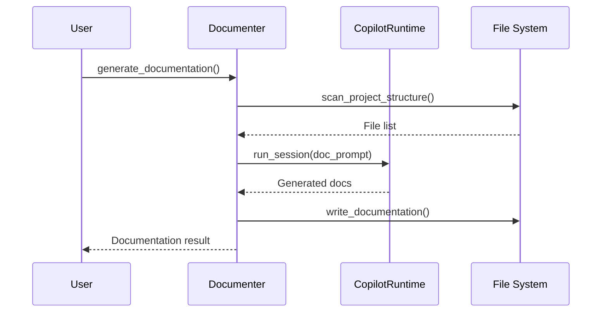
```mermaid
sequenceDiagram
    participant U as User
    participant DA as Documenter
    participant CR as CopilotRuntime
    participant FS as File System
    
    U->>DA: generate_documentation()
    DA->>FS: scan_project_structure()
    FS-->>DA: File list
    DA->>CR: run_session(doc_prompt)
    CR-->>DA: Generated docs
    DA->>FS: write_documentation()
    DA-->>U: Documentation result
```

### 4. Refactoring Agent
**Fichier** : `apps/backend/agents/refactorer.py`

#### Workflow d'Appel

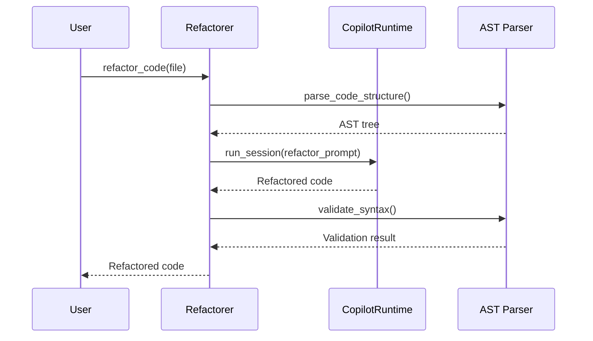
```mermaid
sequenceDiagram
    participant U as User
    participant RA as Refactorer
    participant CR as CopilotRuntime
    participant AST as AST Parser
    
    U->>RA: refactor_code(file)
    RA->>AST: parse_code_structure()
    AST-->>RA: AST tree
    RA->>CR: run_session(refactor_prompt)
    CR-->>RA: Refactored code
    RA->>AST: validate_syntax()
    AST-->>RA: Validation result
    RA-->>U: Refactored code
```

### 5. Test Generator Agent
**Fichier** : `apps/backend/agents/test_generator.py`

#### Workflow d'Appel

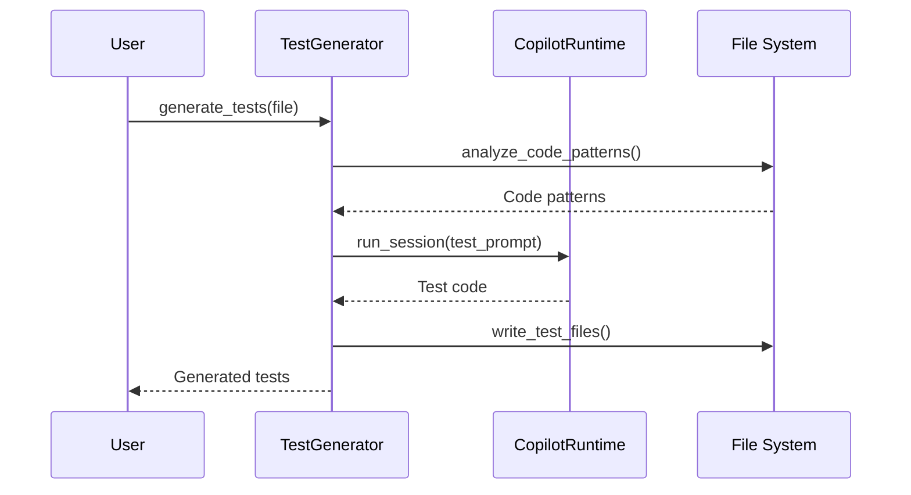
```mermaid
sequenceDiagram
    participant U as User
    participant TG as TestGenerator
    participant CR as CopilotRuntime
    participant FS as File System
    
    U->>TG: generate_tests(file)
    TG->>FS: analyze_code_patterns()
    FS-->>TG: Code patterns
    TG->>CR: run_session(test_prompt)
    CR-->>TG: Test code
    TG->>FS: write_test_files()
    TG-->>U: Generated tests
```

---

## Skills System

### 1. Skill Manager
**Fichier** : `apps/backend/skills/skill_manager.py`

#### Workflow d'Appel

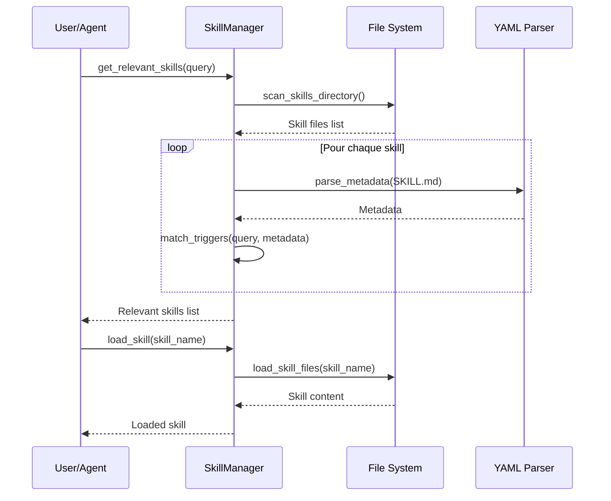
```mermaid
sequenceDiagram
    participant U as User/Agent
    participant SM as SkillManager
    participant FS as File System
    participant YML as YAML Parser
    
    U->>SM: get_relevant_skills(query)
    SM->>FS: scan_skills_directory()
    FS-->>SM: Skill files list
    loop Pour chaque skill
        SM->>YML: parse_metadata(SKILL.md)
        YML-->>SM: Metadata
        SM->>SM: match_triggers(query, metadata)
    end
    SM-->>U: Relevant skills list
    
    U->>SM: load_skill(skill_name)
    SM->>FS: load_skill_files(skill_name)
    FS-->>SM: Skill content
    SM-->>U: Loaded skill
```

**Chargement Progressif (3 niveaux)** :
1. **Niveau 1** : Métadonnées YAML (toujours chargées)
2. **Niveau 2** : Instructions Markdown (chargé au déclenchement)
3. **Niveau 3** : Scripts et ressources (chargé à la demande)

### 2. Framework Migration Skill
**Fichier** : `apps/backend/skills/migration/`

#### Workflow d'Appel

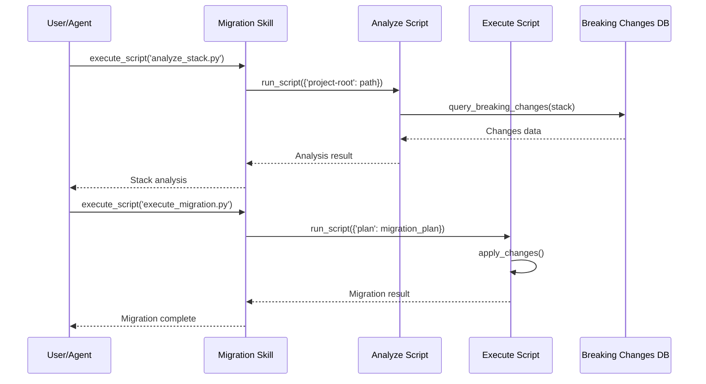
```mermaid
sequenceDiagram
    participant U as User/Agent
    participant MS as Migration Skill
    participant AS as Analyze Script
    participant EM as Execute Script
    participant BC as Breaking Changes DB
    
    U->>MS: execute_script('analyze_stack.py')
    MS->>AS: run_script({'project-root': path})
    AS->>BC: query_breaking_changes(stack)
    BC-->>AS: Changes data
    AS-->>MS: Analysis result
    MS-->>U: Stack analysis
    
    U->>MS: execute_script('execute_migration.py')
    MS->>EM: run_script({'plan': migration_plan})
    EM->>EM: apply_changes()
    EM-->>MS: Migration result
    MS-->>U: Migration complete
```

**Scripts disponibles** :
- `analyze_stack.py` : Analyse du stack technologique
- `execute_migration.py` : Exécution de la migration

**Ressources** :
- `data/breaking_changes.json` : Base de données des changements
- `templates/migration_plan.md` : Template de plan

### 3. Composite Skills
**Fichier** : `apps/backend/skills/composite_skills.py`

#### Workflow d'Appel

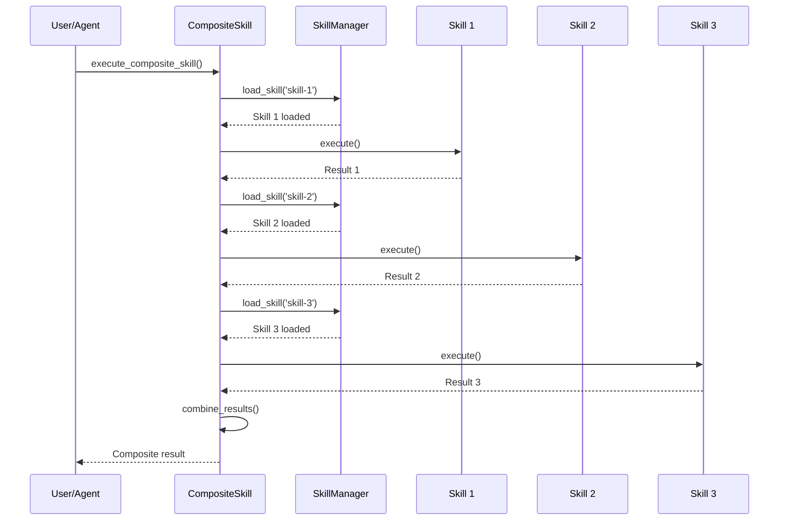
```mermaid
sequenceDiagram
    participant U as User/Agent
    participant CS as CompositeSkill
    participant SM as SkillManager
    participant S1 as Skill 1
    participant S2 as Skill 2
    participant S3 as Skill 3
    
    U->>CS: execute_composite_skill()
    CS->>SM: load_skill('skill-1')
    SM-->>CS: Skill 1 loaded
    CS->>S1: execute()
    S1-->>CS: Result 1
    
    CS->>SM: load_skill('skill-2')
    SM-->>CS: Skill 2 loaded
    CS->>S2: execute()
    S2-->>CS: Result 2
    
    CS->>SM: load_skill('skill-3')
    SM-->>CS: Skill 3 loaded
    CS->>S3: execute()
    S3-->>CS: Result 3
    
    CS->>CS: combine_results()
    CS-->>U: Composite result
```

### 4. Distributed Skills
**Fichier** : `apps/backend/skills/distributed_skills.py`

#### Workflow d'Appel

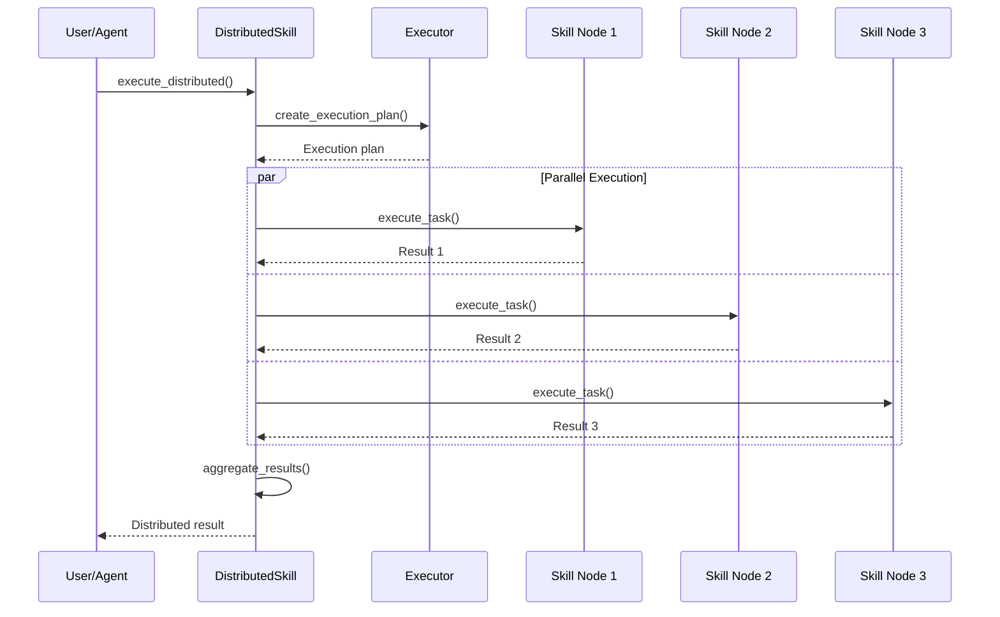
```mermaid
sequenceDiagram
    participant U as User/Agent
    participant DS as DistributedSkill
    participant EX as Executor
    participant S1 as Skill Node 1
    participant S2 as Skill Node 2
    participant S3 as Skill Node 3
    
    U->>DS: execute_distributed()
    DS->>EX: create_execution_plan()
    EX-->>DS: Execution plan
    
    par Parallel Execution
        DS->>S1: execute_task()
        S1-->>DS: Result 1
    and
        DS->>S2: execute_task()
        S2-->>DS: Result 2
    and
        DS->>S3: execute_task()
        S3-->>DS: Result 3
    end
    
    DS->>DS: aggregate_results()
    DS-->>U: Distributed result
```

---

## Services de Support

### 1. GitHub Orchestrator
**Fichier** : `apps/backend/runners/github/orchestrator.py`

#### Workflow d'Appel

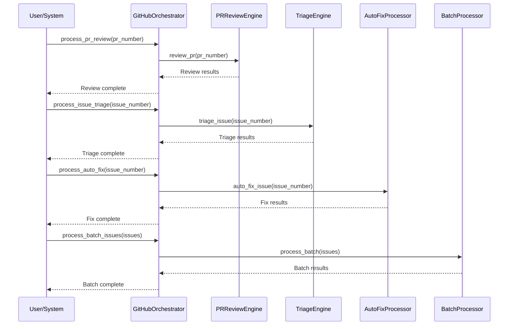
```mermaid
sequenceDiagram
    participant U as User/System
    participant GO as GitHubOrchestrator
    participant PRE as PRReviewEngine
    participant TE as TriageEngine
    participant AFP as AutoFixProcessor
    participant BP as BatchProcessor
    
    U->>GO: process_pr_review(pr_number)
    GO->>PRE: review_pr(pr_number)
    PRE-->>GO: Review results
    GO-->>U: Review complete
    
    U->>GO: process_issue_triage(issue_number)
    GO->>TE: triage_issue(issue_number)
    TE-->>GO: Triage results
    GO-->>U: Triage complete
    
    U->>GO: process_auto_fix(issue_number)
    GO->>AFP: auto_fix_issue(issue_number)
    AFP-->>GO: Fix results
    GO-->>U: Fix complete
    
    U->>GO: process_batch_issues(issues)
    GO->>BP: process_batch(issues)
    BP-->>GO: Batch results
    GO-->>U: Batch complete
```

### 2. PR Context Gatherer
**Fichier** : `apps/backend/runners/github/context_gatherer.py`

#### Workflow d'Appel

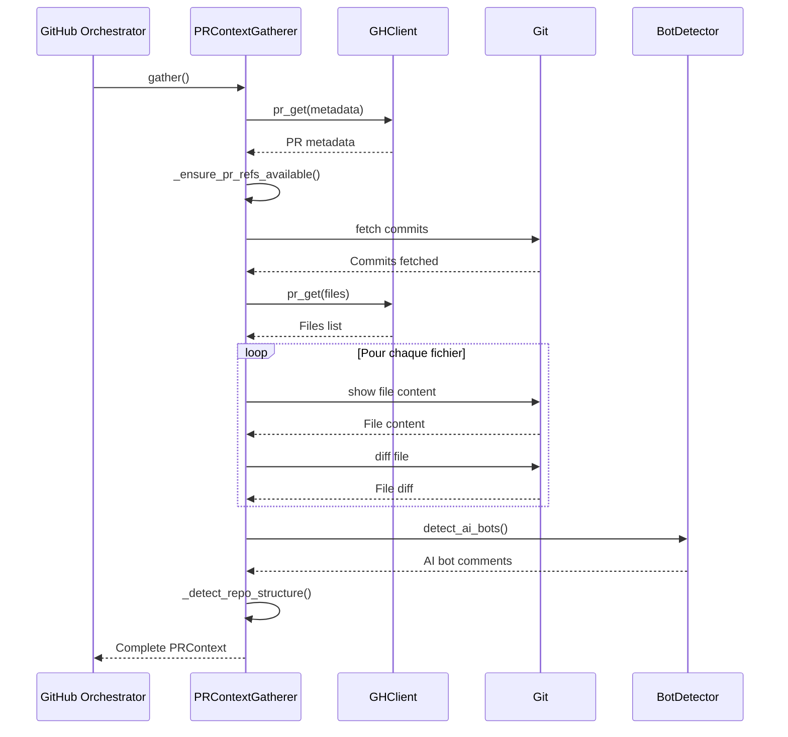
```mermaid
sequenceDiagram
    participant U as GitHub Orchestrator
    participant PCG as PRContextGatherer
    participant GHC as GHClient
    participant GIT as Git
    participant BD as BotDetector
    
    U->>PCG: gather()
    PCG->>GHC: pr_get(metadata)
    GHC-->>PCG: PR metadata
    PCG->>PCG: _ensure_pr_refs_available()
    PCG->>GIT: fetch commits
    GIT-->>PCG: Commits fetched
    
    PCG->>GHC: pr_get(files)
    GHC-->>PCG: Files list
    loop Pour chaque fichier
        PCG->>GIT: show file content
        GIT-->>PCG: File content
        PCG->>GIT: diff file
        GIT-->>PCG: File diff
    end
    
    PCG->>BD: detect_ai_bots()
    BD-->>PCG: AI bot comments
    PCG->>PCG: _detect_repo_structure()
    PCG-->>U: Complete PRContext
```

### 3. PR Review Engine
**Fichier** : `apps/backend/runners/github/services/`

#### Workflow d'Appel

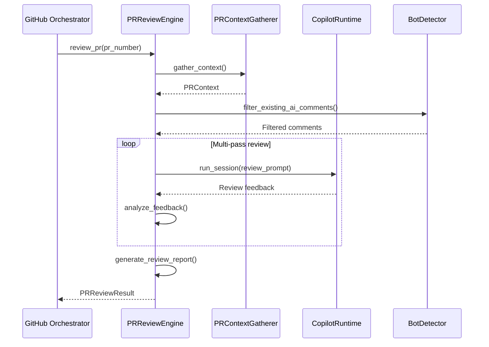
```mermaid
sequenceDiagram
    participant U as GitHub Orchestrator
    participant PRE as PRReviewEngine
    participant PCG as PRContextGatherer
    participant CR as CopilotRuntime
    participant BD as BotDetector
    
    U->>PRE: review_pr(pr_number)
    PRE->>PCG: gather_context()
    PCG-->>PRE: PRContext
    PRE->>BD: filter_existing_ai_comments()
    BD-->>PRE: Filtered comments
    
    loop Multi-pass review
        PRE->>CR: run_session(review_prompt)
        CR-->>PRE: Review feedback
        PRE->>PRE: analyze_feedback()
    end
    
    PRE->>PRE: generate_review_report()
    PRE-->>U: PRReviewResult
```

### 4. Triage Engine
**Fichier** : `apps/backend/runners/github/services/`

#### Workflow d'Appel

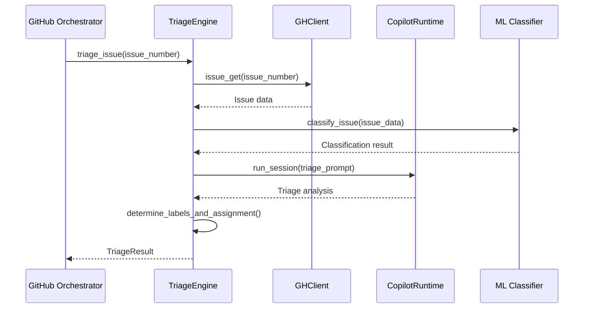
```mermaid
sequenceDiagram
    participant U as GitHub Orchestrator
    participant TE as TriageEngine
    participant GHC as GHClient
    participant CR as CopilotRuntime
    participant ML as ML Classifier
    
    U->>TE: triage_issue(issue_number)
    TE->>GHC: issue_get(issue_number)
    GHC-->>TE: Issue data
    TE->>ML: classify_issue(issue_data)
    ML-->>TE: Classification result
    TE->>CR: run_session(triage_prompt)
    CR-->>TE: Triage analysis
    TE->>TE: determine_labels_and_assignment()
    TE-->>U: TriageResult
```

### 5. Auto Fix Processor
**Fichier** : `apps/backend/runners/github/services/`

#### Workflow d'Appel

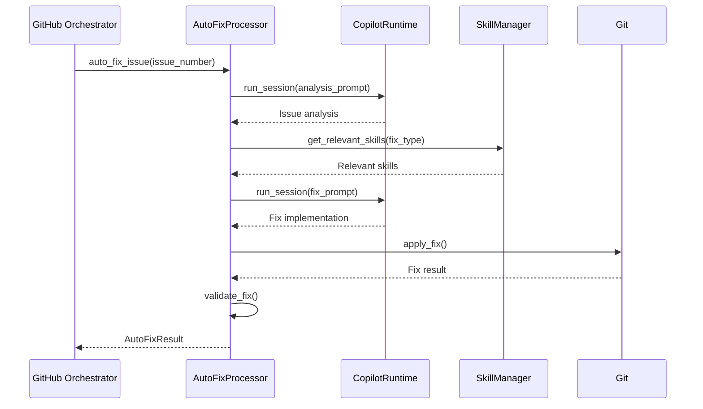
```mermaid
sequenceDiagram
    participant U as GitHub Orchestrator
    participant AFP as AutoFixProcessor
    participant CR as CopilotRuntime
    participant SM as SkillManager
    participant GIT as Git
    
    U->>AFP: auto_fix_issue(issue_number)
    AFP->>CR: run_session(analysis_prompt)
    CR-->>AFP: Issue analysis
    AFP->>SM: get_relevant_skills(fix_type)
    SM-->>AFP: Relevant skills
    AFP->>CR: run_session(fix_prompt)
    CR-->>AFP: Fix implementation
    AFP->>GIT: apply_fix()
    GIT-->>AFP: Fix result
    AFP->>AFP: validate_fix()
    AFP-->>U: AutoFixResult
```

---

## Hooks et Intégrations

### 1. Git Hooks
**Fichier** : `apps/backend/security/git_hooks.py`

#### Workflow d'Appel

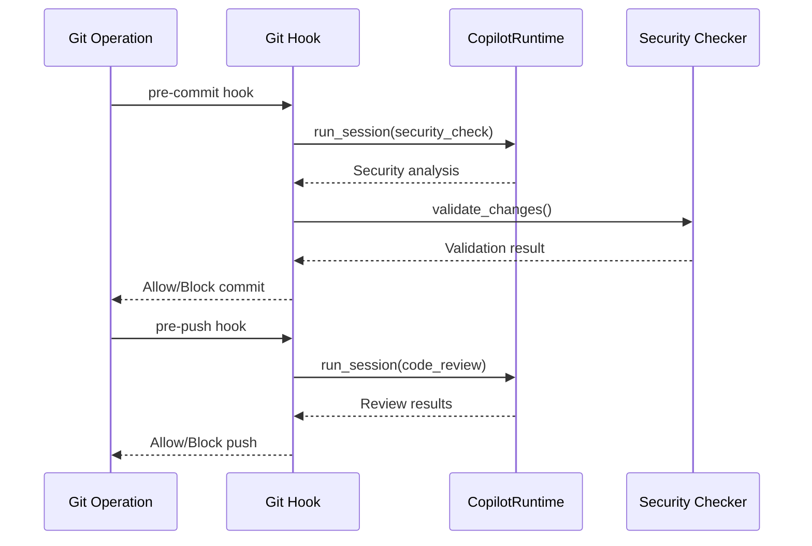
```mermaid
sequenceDiagram
    participant GIT as Git Operation
    participant GH as Git Hook
    participant CR as CopilotRuntime
    participant SEC as Security Checker
    
    GIT->>GH: pre-commit hook
    GH->>CR: run_session(security_check)
    CR-->>GH: Security analysis
    GH->>SEC: validate_changes()
    SEC-->>GH: Validation result
    GH-->>GIT: Allow/Block commit
    
    GIT->>GH: pre-push hook
    GH->>CR: run_session(code_review)
    CR-->>GH: Review results
    GH-->>GIT: Allow/Block push
```

### 2. Merge Hooks
**Fichier** : `apps/backend/merge/install_hook.py`

#### Workflow d'Appel

```mermaid
sequenceDiagram
    participant PR as Pull Request
    participant MH as Merge Hook
    participant PRE as PRReviewEngine
    participant AFP as AutoFixProcessor
    participant GIT as Git
    
    PR->>MH: merge_request
    MH->>PRE: review_pr()
    PRE-->>MH: Review results
    MH->>AFP: check_auto_fixes()
    AFP-->>MH: Fix status
    
    alt Review passed
        MH->>GIT: merge_branch()
        GIT-->>MH: Merge complete
    else Review failed
        MH-->>PR: Block merge
    end
```

### 3. Rate Limiting
**Fichier** : `apps/backend/runners/github/rate_limiter.py`

#### Workflow d'Appel

```mermaid
sequenceDiagram
    participant API as GitHub API Call
    participant RL as RateLimiter
    participant CACHE as Rate Cache
    participant GH as GitHub CLI
    
    API->>RL: check_rate_limit()
    RL->>CACHE: get_current_usage()
    CACHE-->>RL: Usage data
    RL->>RL: calculate_remaining()
    
    alt Rate limit OK
        RL-->>API: Allow request
        API->>GH: execute_api_call()
        GH-->>API: Response
        API->>CACHE: update_usage()
    else Rate limit exceeded
        RL-->>API: Block request
        RL->>RL: schedule_retry()
    end
```

---

## Outils et Utilitaires

### 1. Token Optimizer
**Fichier** : `apps/backend/skills/token_optimizer.py`

#### Workflow d'Appel

```mermaid
sequenceDiagram
    participant U as User/Agent
    participant TO as TokenOptimizer
    participant ANAL as Analyzer
    participant CACHE as Token Cache
    
    U->>TO: optimize_tokens(content)
    TO->>ANAL: analyze_token_usage()
    ANAL-->>TO: Usage patterns
    TO->>CACHE: check_cached_optimization()
    CACHE-->>TO: Cached result
    
    alt No cache hit
        TO->>TO: apply_optimization_strategies()
        TO->>CACHE: cache_optimization()
    end
    
    TO-->>U: Optimized content
```

### 2. Context Optimizer
**Fichier** : `apps/backend/skills/context_optimizer.py`

#### Workflow d'Appel

```mermaid
sequenceDiagram
    participant U as User/Agent
    participant CO as ContextOptimizer
    participant REL as Relevance Engine
    participant COMP as Compression
    
    U->>CO: optimize_context(context, query)
    CO->>REL: calculate_relevance_scores()
    REL-->>CO: Relevance scores
    CO->>CO: select_high_relevance_items()
    CO->>COMP: compress_context()
    COMP-->>CO: Compressed context
    CO-->>U: Optimized context
```

### 3. Predictive Cache
**Fichier** : `apps/backend/skills/predictive_cache.py`

#### Workflow d'Appel

```mermaid
sequenceDiagram
    participant U as User/Agent
    participant PC as PredictiveCache
    participant ML as ML Predictor
    participant CACHE as Cache Storage
    
    U->>PC: get_cached_result(query)
    PC->>CACHE: check_cache()
    CACHE-->>PC: Cache result
    
    alt Cache hit
        PC-->>U: Cached result
    else Cache miss
        PC->>ML: predict_future_queries()
        ML-->>PC: Predictions
        PC->>CACHE: preload_predictions()
        PC-->>U: Cache miss
    end
```

### 4. Skill Metrics
**Fichier** : `apps/backend/skills/skill_metrics.py`

#### Workflow d'Appel

```mermaid
sequenceDiagram
    participant U as User/Agent
    participant SM as SkillMetrics
    participant MET as Metrics Store
    participant ANAL as Analytics Engine
    
    U->>SM: track_skill_usage(skill, result)
    SM->>MET: record_usage()
    MET-->>SM: Recorded
    
    U->>SM: get_skill_metrics()
    SM->>MET: query_metrics()
    MET-->>SM: Raw metrics
    SM->>ANAL: analyze_metrics()
    ANAL-->>SM: Analytics
    SM-->>U: Metrics report
```

---

## Frontend Integration

### 1. GitHub Copilot Service
**Fichier** : `apps/frontend/src/main/services/github-copilot-service.ts`

#### Workflow d'Appel

```mermaid
sequenceDiagram
    participant UI as Frontend UI
    participant GCS as GitHubCopilotService
    participant IPC as IPC Handler
    participant BE as Backend Service
    
    UI->>GCS: authenticate_copilot()
    GCS->>IPC: invoke_copilot_auth()
    IPC-->>BE: auth_request
    BE-->>IPC: auth_result
    IPC-->>GCS: auth_status
    GCS-->>UI: authentication_result
    
    UI->>GCS: execute_copilot_task()
    GCS->>IPC: invoke_copilot_task()
    IPC-->>BE: task_request
    BE-->>IPC: task_result
    IPC-->>GCS: task_response
    GCS-->>UI: task_completion
```

### 2. Provider Registry UI
**Fichier** : `apps/frontend/src/shared/services/providerRegistry.ts`

#### Workflow d'Appel

```mermaid
sequenceDiagram
    participant UI as Settings UI
    participant PR as ProviderRegistry
    participant IPC as IPC Handler
    participant BE as Backend
    
    UI->>PR: check_provider_status('copilot')
    PR->>IPC: get_provider_status()
    IPC-->>BE: status_request
    BE-->>IPC: provider_status
    IPC-->>PR: status_response
    PR-->>UI: status_display
    
    UI->>PR: configure_provider('copilot', config)
    PR->>IPC: configure_provider()
    IPC-->>BE: config_request
    BE-->>IPC: config_result
    IPC-->>PR: config_response
    PR-->>UI: config_confirmation
```

### 3. Configuration UI
**Fichier** : `apps/frontend/src/renderer/components/settings/GitHubCopilotConfig.tsx`

#### Workflow d'Appel

```mermaid
sequenceDiagram
    participant U as User
    participant GCC as GitHubCopilotConfig
    participant GCS as GitHubCopilotService
    participant CT as CopilotAuthTerminal
    
    U->>GCC: open_copilot_settings()
    GCC->>GCS: get_current_config()
    GCS-->>GCC: current_config
    GCC-->>U: settings_display
    
    U->>GCC: authenticate_copilot()
    GCC->>CT: show_auth_terminal()
    CT->>GCS: start_oauth_flow()
    GCS-->>CT: auth_result
    CT-->>GCC: authentication_complete
    GCC-->>U: auth_success
```

---

## Workflows d'Appel Complets

### Workflow 1 : Session de Codage Autonome

```mermaid
sequenceDiagram
    participant U as User
    participant AA as AutonomousAgent
    participant SM as SkillManager
    participant MM as MemoryManager
    participant CR as CopilotRuntime
    participant GH as GitHub CLI
    
    U->>AA: run_autonomous_agent(spec)
    AA->>SM: get_relevant_skills(spec)
    SM-->>AA: relevant_skills
    AA->>MM: get_graphiti_context(spec)
    MM-->>AA: context_data
    AA->>CR: run_session(prompt, tools)
    CR->>GH: gh copilot suggest -t shell prompt
    GH-->>CR: copilot_response
    CR-->>AA: session_result
    AA->>MM: save_session_memory(result)
    AA-->>U: final_result
```

### Workflow 2 : Review de PR avec Copilot

```mermaid
sequenceDiagram
    participant U as GitHub Webhook
    participant GO as GitHubOrchestrator
    participant PCG as PRContextGatherer
    participant PRE as PRReviewEngine
    participant CR as CopilotRuntime
    participant GH as GitHub API
    
    U->>GO: pr_review_webhook
    GO->>PCG: gather_pr_context(pr_number)
    PCG->>GH: fetch_pr_data()
    GH-->>PCG: pr_metadata
    PCG->>GH: fetch_changed_files()
    GH-->>PCG: files_content
    PCG-->>GO: complete_context
    GO->>PRE: review_pr(context)
    PRE->>CR: run_session(review_prompt)
    CR-->>PRE: review_analysis
    PRE->>PRE: generate_findings()
    PRE-->>GO: review_results
    GO->>GH: post_review_comment()
    GO-->>U: review_complete
```

### Workflow 3 : Migration de Framework

```mermaid
sequenceDiagram
    participant U as User
    participant MA as MigrationAgent
    participant SMW as SkillWrapper
    participant MS as MigrationSkill
    participant CR as CopilotRuntime
    participant GH as GitHub CLI
    
    U->>MA: migrate_framework(from, to)
    MA->>SMW: load_skill('framework-migration')
    SMW->>MS: execute_script('analyze_stack.py')
    MS-->>SMW: stack_analysis
    SMW-->>MA: formatted_analysis
    MA->>CR: run_session(migration_prompt)
    CR-->>MA: migration_plan
    MA->>MS: execute_script('execute_migration.py')
    MS-->>MA: migration_result
    MA->>CR: run_session(validation_prompt)
    CR-->>MA: validation_result
    MA-->>U: migration_complete
```

### Workflow 4 : Triage d'Issue Automatique

```mermaid
sequenceDiagram
    participant U as GitHub Webhook
    participant GO as GitHubOrchestrator
    participant TE as TriageEngine
    participant CR as CopilotRuntime
    participant ML as ML Classifier
    participant GH as GitHub API
    
    U->>GO: issue_created_webhook
    GO->>TE: triage_issue(issue_number)
    TE->>GH: fetch_issue_data()
    GH-->>TE: issue_data
    TE->>ML: classify_issue(issue_data)
    ML-->>TE: classification
    TE->>CR: run_session(triage_prompt)
    CR-->>TE: triage_analysis
    TE->>TE: determine_labels_assignment()
    TE->>GH: apply_labels_and_assignment()
    GH-->>TE: update_result
    TE-->>GO: triage_complete
    GO-->>U: triage_processed
```

### Workflow 5 : Session Frontend avec Copilot

```mermaid
sequenceDiagram
    participant U as Frontend User
    participant GCC as GitHubCopilotConfig
    participant GCS as GitHubCopilotService
    participant IPC as IPC Handler
    participant CR as CopilotRuntime
    participant GH as GitHub CLI
    
    U->>GCC: initiate_copilot_session()
    GCC->>GCS: check_authentication()
    GCS->>IPC: check_copilot_auth()
    IPC-->>GCS: auth_status
    GCS-->>GCC: authentication_result
    GCC-->>U: auth_display
    
    U->>GCC: execute_copilot_task(prompt)
    GCC->>GCS: send_copilot_request()
    GCS->>IPC: invoke_copilot_session()
    IPC->>CR: run_session(prompt)
    CR->>GH: gh copilot suggest prompt
    GH-->>CR: copilot_response
    CR-->>IPC: session_result
    IPC-->>GCS: task_response
    GCS-->>GCC: formatted_result
    GCC-->>U: display_result
```

### Workflow 6 : Optimisation de Skills

```mermaid
sequenceDiagram
    participant U as Agent System
    participant SM as SkillManager
    participant TO as TokenOptimizer
    participant CO as ContextOptimizer
    participant PC as PredictiveCache
    participant MS as MigrationSkill
    
    U->>SM: execute_skill('framework-migration')
    SM->>TO: optimize_skill_content()
    TO-->>SM: optimized_content
    SM->>CO: optimize_execution_context()
    CO-->>SM: optimized_context
    SM->>PC: check_cached_result()
    PC-->>SM: cached_result
    
    alt Cache miss
        SM->>MS: load_and_execute()
        MS-->>SM: execution_result
        SM->>PC: cache_result()
    end
    
    SM-->>U: skill_result
```

### Workflow 7 : Monitoring et Métriques

```mermaid
sequenceDiagram
    participant U as System Admin
    participant SM as SkillMetrics
    participant CUC as CopilotUsageConnector
    participant RL as RateLimiter
    participant GH as GitHub CLI
    participant API as GitHub API
    
    U->>SM: generate_metrics_report()
    SM->>CUC: get_usage_metrics()
    CUC->>GH: gh api copilot/metrics
    GH-->>CUC: usage_data
    CUC-->>SM: formatted_metrics
    
    U->>RL: check_rate_limits()
    RL->>API: query_rate_limit_status()
    API-->>RL: limit_status
    RL-->>U: rate_limit_report
    
    SM->>SM: analyze_performance_trends()
    SM-->>U: comprehensive_report
```

---

## Conclusion

Cette architecture complète de GitHub Copilot intègre :

- **Runtime principal** : CopilotRuntime et CopilotAgentClient
- **Agents spécialisés** : 5+ agents pour différentes tâches
- **Skills system** : Architecture modulaire avec chargement progressif
- **Services GitHub** : Orchestration complète des workflows GitHub
- **Frontend integration** : Interface utilisateur complète
- **Optimisation** : Token, contexte et cache prédictif
- **Monitoring** : Métriques complètes et rate limiting

Le système supporte des workflows complexes allant du codage autonome à la review de PR en passant par la migration de frameworks, le tout optimisé pour les performances et la maintenabilité.
